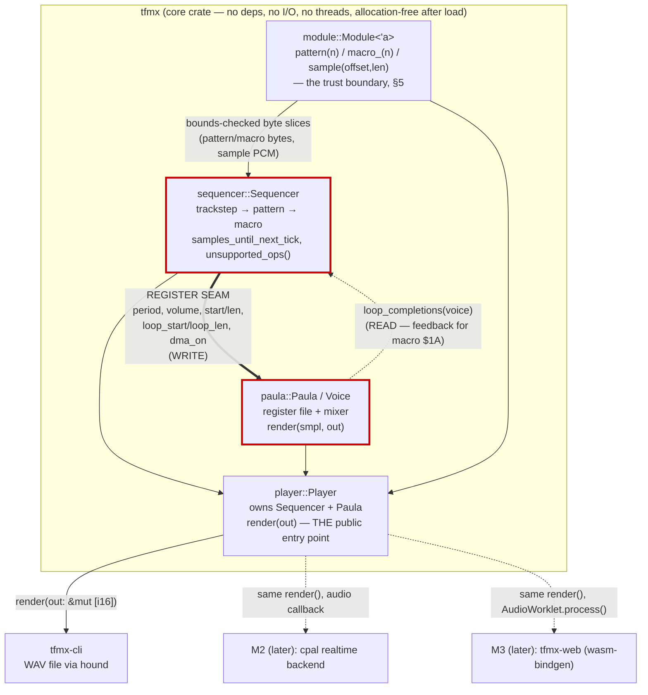
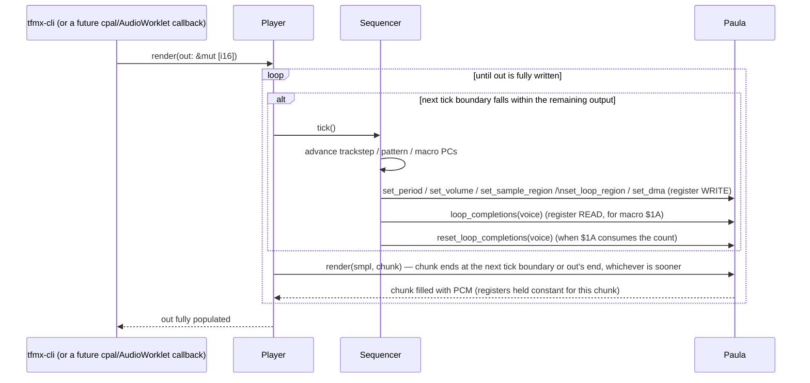

# TFMX Player — Architecture (the code shape)

This document describes how the Rust code is shaped: crate layout, the seam between
sequencing and mixing, the `render()` contract callers must honor, the allocation and
threading rules, the public API, and the corners this design deliberately cuts. For
*what the bytes mean* see [`format.md`](format.md) and [`opcodes.md`](opcodes.md); for
*what happens when those bytes run* see [`playback-model.md`](playback-model.md) — this
document assumes both and does not restate them.

The Rust signatures below are a **design sketch**, not final code — types, method
names and module paths are fixed where the roadmap already names them, and clearly
flagged where this document introduces a new name.

---

## 1. Crate layout

Two crates, matching the workspace already in `Cargo.toml`:

| Crate | Role | Dependencies |
|---|---|---|
| `tfmx` | Parser, mixer, sequencer — the decoder itself | none (deliberately) |
| `tfmx-cli` | Command-line front end: file I/O, WAV output | `tfmx`, `clap`, `hound` |

`tfmx` is organized as one module per concern, each owning one of the roadmap's
already-named types:

| Module (planned) | Owns | Roadmap origin |
|---|---|---|
| `tfmx::module` | `Module<'a>`, `ParseError`, `AccessError` | Phase 2 |
| `tfmx::paula` | `Paula`, `Voice` — the register file and mixer | Phase 3 ("Paula mixer") |
| `tfmx::sequencer` | `Sequencer`, `UnsupportedOps` — trackstep/pattern/macro state machines | Phase 4 ("Sequencer") |
| `tfmx::player` | `Player` — ties the above together behind one `render()` | **new, see below** |

`Sequencer` and `Paula` are not introduced by this document — they are the phase 3/4
names from [ROADMAP.md](../ROADMAP.md) ("Paula mixer", "Sequencer (the hard part)"),
used here in the type-name sense. `Player` is genuinely new: nothing in the roadmap
names the type that owns tick scheduling end-to-end and exposes the single `render()`
the CLI calls. It exists because Phase 4's block-size-independence check (step 4.1)
and Phase 3's mixer-in-isolation check (step 3.2) are checks on two *different*
things — `Paula::render()` renders one chunk against constant register state,
`Player::render()` is the tick-aware wrapper the roadmap's step 4.1 acceptance test
implicitly needs a home for. See §3.



The double-line edge (`==>`) marked **REGISTER SEAM** is the one boundary this whole
document is organized around; see §2.

---

## 2. The register seam

The sequencer never touches audio samples, and the mixer never touches trackstep,
pattern or macro state. The only thing that crosses between them is a fixed set of
per-voice register values — the fields of `Voice` — written by the sequencer and
read by the mixer, plus one value flowing the other way: a loop-completion count read
by the sequencer. This is the seam marked in the diagram above, and it sits exactly
where Paula's real hardware register interface sits (`playback-model.md` §1–§2): the
macro program *writes* period/volume/pointers/DMA-enable, and Paula's DMA engine
*reads* them once per audio sample, unaware of how they got there.

Three consequences of putting the boundary there, not somewhere more convenient:

1. **The mixer is testable without a working sequencer.** `Paula::render()` (step
   3.2's target) takes whatever `Voice` state is currently latched and produces PCM;
   step 3.2's acceptance test (synthesize a known period, count zero crossings) sets
   `Voice` fields directly and never runs a trackstep or macro program. If the seam
   were drawn anywhere inside the mixer (e.g. mixer code reaching back into macro
   state for "is this note still portamento-ing"), that test would not be possible in
   isolation.
2. **It is the only place `$1A <Wait on DMA>` can be implemented at all.**
   `playback-model.md` §1 and §6 establish that only the component walking Paula's
   DMA pointer at sample granularity — the mixer — knows when a sample region has
   completed a play-through. The macro interpreter needs that count to implement
   `$1A`'s "plays the sample `aaaa` times, then continues." Drawing the seam at the
   register file gives the mixer a natural place to keep that count (`Voice`'s
   fractional-position bookkeeping already tracks pointer wraparound) and the
   sequencer a natural place to ask for it (`Paula::loop_completions(voice)`) without
   either side reaching into the other's internals.
3. **It is what a future backend or format variant reuses.** A hardware-accurate
   Amiga backend, a different sequencer (TFMX 7V — see §9), or a test harness that
   drives `Voice` fields directly to reproduce a specific bug all sit on the *writer*
   side of this same seam and get the *same* mixer for free. Nothing about `Paula`
   or `Voice` encodes anything about how the register values were decided — that
   asymmetry is the point.

`Voice` carries exactly the fields the roadmap's step 3.1 names, plus one field this
document adds (flagged): a fractional playback position, needed for linear
interpolation (§8) and not meaningful to anything outside `Paula`.

```rust
// paula.rs — design sketch, not final
pub struct Voice {
    pub start: u32,       // byte offset into smpl (absolute — format.md §8, playback-model.md §6)
    pub len: u32,         // sample length, in words (1 = 2 bytes), per format.md §2
    pub period: u16,      // Paula period; freq_hz = 3_546_895 / period (playback-model.md §2.1)
    pub volume: u8,       // 0..=64 (playback-model.md §2.2)
    pub dma_on: bool,
    pub loop_start: u32,
    pub loop_len: u32,
    frac: u32,             // NEW: sub-sample playback position, private — mixer-internal only
}
```

`Voice` holds *offsets* into `smpl`, never the PCM itself, so `Paula` needs the sample
buffer handed to it to render. It is a **parameter of `Paula::render()`** rather than a
field, deliberately: `Paula` then carries no lifetime, stays a plain
`[Voice; 4]` register file, and step 3.2's mixer test can drive it with a synthetic
sample buffer — a generated sine — without constructing a `Module` at all. `Player`
holds the `&'a [i8]` obtained from `Module` once and passes it down on every chunk.

### The trace seam (step 11.3)

`Player` was, until M4, unobservable from outside — `unsupported_ops()` was its only
public getter. `TraceEvent` (`tfmx/src/trace.rs`) is a second seam alongside the
register seam above, for the same reason that one exists: it lets a caller watch state
transitions cross a boundary without either side reaching into the other's internals.
Where the register seam is a *value* (`Voice`, read every sample), the trace seam is an
*event stream* (`TraceEvent`, emitted once per transition) — `Jiffy` (the tick
boundary), `Trackstep` (the decoded line), `Pattern` (one longword executed, tagged
with which track/pattern/step it came from), `Trigger` (a macro (re)started on a
voice — emitted from the dispatch site rather than re-derived, because `voice_of()`'s
nibble masking is a documented uncertainty and a masking bug has to be visible in the
trace, not silently reinterpreted by whatever reads it) and `Voice` (a snapshot of that
same `Voice` register-seam value, four per jiffy, one per hardware voice).

The generic-sibling shape keeps this free when unused: `Player::render_inner<F: FnMut(TraceEvent)>` does the actual work, `render()` calls it with `|_| {}` (monomorphizing away
to exactly the pre-11.3 code — the golden hashes are the load-bearing proof of that),
and `render_traced()` calls it with a real closure. `run_jiffy` and
`dispatch_pattern_entry` both take `trace: &mut impl FnMut(TraceEvent)` and call it
inline at the point each event is known, mirroring the crate's existing idiom
(`PatternRunner::advance` and `MacroInterpreter::tick` already take an `emit` closure)
rather than introducing a new event-bus abstraction.

All formatting, folding, de-duplication and analysis of the event stream is a consumer
concern (`tfmx-cli`, steps 11.4–11.5) — `TraceEvent` itself stays a plain enum with no
dependency, no allocation and no I/O, so it builds for `wasm32-unknown-unknown`
unchanged like the rest of the core.

---

## 3. The `render()` contract

Two `render()` methods exist at two different levels, matching the two different
things Phase 3 and Phase 4 each test:

```rust
impl Paula {
    /// Synthesizes `out.len()` interleaved stereo samples from whatever `Voice`
    /// state is currently latched, reading PCM out of `smpl`. Register state is
    /// treated as CONSTANT across the whole call — this method does not know
    /// about ticks at all.
    pub fn render(&mut self, smpl: &[i8], out: &mut [i16]);
}

impl<'a> Player<'a> {
    /// THE render() contract: fills `out` with interleaved stereo PCM, running
    /// the sequencer's tick clock and the mixer together. This is what tfmx-cli
    /// (and, later, a cpal or AudioWorklet callback) calls.
    pub fn render(&mut self, out: &mut [i16]);
}
```

`Player::render()` is the tick-aware wrapper: it is exactly the chunking loop
`playback-model.md` §3.4 already specifies (`run_one_jiffy_tick()` at each tick
boundary, `synthesize(chunk, current_register_state)` — i.e. `Paula::render()` — in
between).

**Tempo and phase are owned by different types**, and keeping them apart is what makes
block-size independence hold:

- **`Sequencer` owns the tempo** — the `(num, den)` tick-rate fraction of
  `playback-model.md` §3.4, derived from the song's tempo-table slot and updated by
  `$EFFE 0002 SetTempo`. `samples_until_next_tick(sample_rate)` reports the current
  tick length from that fraction; it is a query, and does not advance anything.
- **`Player` owns the phase** — the accumulator remainder (`acc`) and
  `next_boundary_offset`, as private state persisting across `render()` calls. This is
  the state that must *not* reset at a call boundary, which is precisely why it lives on
  the long-lived `Player` and not in a local variable inside `render()`.

A tempo change therefore reassigns `Sequencer`'s fraction while leaving `Player`'s `acc`
untouched, carrying sub-sample phase across the change (`playback-model.md` §3.4).

### What the caller may assume

- **Block-size independence.** Calling `render()` once for `n` samples produces
  bit-identical output to calling it repeatedly for smaller chunks summing to `n`,
  provided the calls are sequential and cover contiguous, non-overlapping output.
  This is a hard requirement, not an aspiration — it is step 4.1's acceptance test
  (one 48000-frame call vs. 480 hundred-frame calls, byte-identical) and it holds
  *because* the tick accumulator is `Player`-internal state, not something the
  caller supplies or that resets between calls.
- Output depends only on the cumulative sample count rendered since construction —
  never on how that count was chunked.
- `render()` performs no I/O and does not allocate (§4); it is safe to call from a
  real-time audio callback once `Player` exists.

### What the caller may not assume

- That a tick boundary aligns with the start or end of any particular `render()`
  call. `playback-model.md` §3.5 draws this out concretely: for typical sample
  rates and tempos, `samples_per_tick` is not an integer multiple of anything the
  caller chose, and a tick fires in the middle of a block far more often than not.
- That block size and tick rate have any fixed relationship. `n` can be smaller
  than, larger than, or not a multiple of `samples_per_tick`; `Player::render()`
  handles zero, one, or several tick boundaries inside a single call.
- That two `Player` instances, or two non-sequential calls on one instance, can be
  used interchangeably — `Player` is a stateful iterator over the song, not a pure
  function of its arguments.



---

## 4. Allocation-free after load

"Allocation-free after load" means concretely:

- **`Module<'a>` borrows, never copies.** `Module::parse(mdat: &'a [u8], smpl: &'a
  [u8]) -> Result<Module<'a>, ParseError>` stores nothing but offsets and slices
  into the two caller-owned buffers. `pattern()`, `macro_()` and `sample()` return
  `&'a [u8]` / `&'a [i8]` slices of those same buffers — never an owned `Vec`. The
  caller (`tfmx-cli`, or later a browser handing over an `ArrayBuffer`) owns the
  bytes for as long as any `Module`, `Sequencer` or `Player` built from them is
  alive; the lifetime parameter `'a` threads through `Sequencer<'a>` and
  `Player<'a>` for exactly this reason.
- **Fixed-size arrays over `Vec` everywhere in the hot path.** `Paula` holds
  `[Voice; 4]` (Amiga hardware has exactly four DMA channels — this is not a
  growable collection). `Sequencer`'s per-track state is `[TrackState; 8]` (eight
  trackstep tracks, `format.md` §5). `UnsupportedOps` (§8) is a fixed `[u32; 256]`
  counter table indexed by raw opcode byte, not a `HashMap`.
- **No allocation inside `render()`, by construction**, since every type it touches
  is stack-sized and fixed once constructed. This is what makes `render()` safe to
  call from a real-time context later (M2's `cpal` callback must not allocate or
  block).
- **Consequence for the API**: every `tfmx` type that outlives parsing carries a
  lifetime tied to the caller's `mdat`/`smpl` buffers. There is no `Module::parse`
  variant that takes ownership of a `Vec<u8>` — that convenience, if wanted, belongs
  in `tfmx-cli` (or `tfmx-web`), not in the dependency-free core.

---

## 5. Untrusted input and the trust boundary

`mdat`/`smpl` pairs are game rips of unknown provenance (`playback-model.md` §6,
`format.md` §9). The trust boundary is exactly `Module`'s accessor methods:
`pattern(n)`, `macro_(n)`, `sample(offset, len)`, and whatever the song/tempo-table
accessors turn out to be (step 2.1). Each bounds-checks against the actual buffer
length and returns `Result<_, AccessError>` rather than indexing raw.

**Nothing past that boundary indexes `mdat` or `smpl` directly.** `Sequencer` and
`Paula` only ever see slices and values `Module` has already validated — a jump
target decoded from a pattern longword is resolved by calling back into `Module`,
not by the sequencer computing a byte offset and slicing the buffer itself. A
corrupted or truncated file fails at the `Module` accessor that first touches the
bad offset, as an `Err`, not as a panic or an out-of-bounds read — this is step
2.3's acceptance test.

---

## 6. Public API (design sketch)

Illustrative signatures, not final — names in **bold** below are fixed by the
roadmap; everything else is this document's proposal for the glue between them.

```rust
// module.rs
pub struct Module<'a> { /* ... */ }

impl<'a> Module<'a> {
    pub fn parse(mdat: &'a [u8], smpl: &'a [u8]) -> Result<Module<'a>, ParseError>;
    pub fn pattern(&self, n: u8) -> Result<&'a [u8], AccessError>;
    pub fn macro_(&self, n: u8) -> Result<&'a [u8], AccessError>;
    pub fn sample(&self, offset: u32, len: u32) -> Result<&'a [i8], AccessError>;
    // song/tempo-table accessors: shape fixed by step 2.1, not sketched here.
}

#[derive(Debug)] pub enum ParseError { /* bad magic, truncated header, ... */ }
#[derive(Debug)] pub enum AccessError { /* index/offset out of range */ } // NEW

// paula.rs
pub struct Voice { /* §2 */ }
pub struct Paula { /* [Voice; 4] */ }

impl Paula {
    pub fn new(separation: u8) -> Self;
    pub fn set_period(&mut self, voice: u8, period: u16);
    pub fn set_volume(&mut self, voice: u8, volume: u8);
    pub fn set_sample_region(&mut self, voice: u8, start: u32, len: u32);
    pub fn set_loop_region(&mut self, voice: u8, loop_start: u32, loop_len: u32);
    pub fn set_dma(&mut self, voice: u8, on: bool);
    pub fn loop_completions(&self, voice: u8) -> u32;      // NEW — the $1A feedback path
    pub fn reset_loop_completions(&mut self, voice: u8);   // NEW
    pub fn render(&mut self, smpl: &[i8], out: &mut [i16]);
}

// sequencer.rs
pub struct Sequencer<'a> { /* trackstep/pattern/macro PCs, tempo state */ }

impl<'a> Sequencer<'a> {
    pub fn new(module: &'a Module<'a>, song: u8) -> Result<Self, AccessError>;
    pub fn samples_until_next_tick(&self, sample_rate: u32) -> u32;
    pub fn tick(&mut self, paula: &mut Paula);
    pub fn unsupported_ops(&self) -> &UnsupportedOps;
}

pub struct UnsupportedOps { /* [u32; 256], indexed by opcode byte */ } // NEW

// player.rs — NEW: the type tfmx-cli and later backends actually hold
pub struct Player<'a> { /* Sequencer<'a> + Paula */ }

impl<'a> Player<'a> {
    pub fn new(module: &'a Module<'a>, song: u8, sample_rate: u32, separation: u8)
        -> Result<Self, AccessError>;
    pub fn render(&mut self, out: &mut [i16]);
    pub fn unsupported_ops(&self) -> &UnsupportedOps;
}
```

`tfmx-cli`'s planned shape (step 5.1) sits directly on top of this:

```
tfmx-cli render <mdat> <smpl> -o out.wav [--song N] [--seconds S] [--rate HZ] [--separation P]
```

reads both files into owned buffers (the only place in the whole pipeline an
allocation for file contents happens), calls `Module::parse`, builds a `Player` with
`--rate`/`--separation`, and calls `render()` into a stack or heap buffer in a loop,
handing each filled block to `hound` — the WAV writer, and all file I/O, live in
`tfmx-cli` only. Step 5.2's `tfmx-cli info` is a thinner consumer of the same
`Module` accessors plus `Player::unsupported_ops()`.

---

## 7. Threading, I/O, and where they actually live

`tfmx` has no threads and no I/O — not "avoids using them where possible," but
structurally cannot: it has no dependency capable of spawning a thread or opening a
file, and every public function takes buffers the caller already owns and writes
into buffers the caller already owns. This is what "must build unchanged for
`wasm32-unknown-unknown`" (`CLAUDE.md`) reduces to in practice: nothing in `tfmx`
needs to change, or even be feature-gated, to compile there, because it never
touches a file handle, a socket, or `std::thread`.

Everything that *does* need a thread or I/O sits outside the core, each behind the
same `Player::render(out: &mut [i16])` call:

| Consumer | I/O / threading it owns | Core change required |
|---|---|---|
| `tfmx-cli` (now) | reads `mdat`/`smpl` files, writes WAV via `hound` | none |
| M2 desktop realtime (`cpal`) | opens an audio device, drives `render()` from cpal's callback thread | none |
| M3 web (`tfmx-web`, wasm-bindgen) | receives `mdat`/`smpl` as JS `ArrayBuffer`s, drives `render()` from an `AudioWorklet`'s `process()` | none |

The register seam (§2) is part of why this holds: `Player::render()` is the only
entry point any of these three need, and it was already required to be
allocation-free and blocking-free for the CLI's own sake (predictable WAV output),
so realtime callers get the same guarantee for free.

---

## 8. Deliberate simplifications, and their upgrade triggers

Each of these is a corner this design cuts on purpose, with a named ceiling and a
named trigger for revisiting it — not a silent shortcut.

- **Naive linear-interpolation resampling, no anti-aliasing**, in `Paula::render()`.
  Accepted for M1 per the roadmap's own risk table ("Aliasing from naive
  resampling | Accepted for M1, marked with a `ponytail:` comment"). Ceiling:
  audible aliasing on high-pitched or heavily-detuned voices, most likely to surface
  in step 6.2's A/B listening pass. Upgrade path: replace the interpolation call
  inside `Paula::render()` with a windowed-sinc or BLEP resampler — it is a
  single-function change because nothing outside `Paula` knows how a sample between
  two `Voice` positions gets computed.
- **Unknown opcodes are recorded, never guessed.** Macro `$22`–`$29` (real-time
  sample manipulation, undocumented per `opcodes.md`), macro `$1B` (`<Random
  play>`, no operand layout stated at all), and pattern `$FE`'s undocumented
  distinguishing behavior relative to `$F4` are each counted in `UnsupportedOps`
  (§6) by the `Sequencer` when encountered, and otherwise treated as a no-op for
  that instruction slot. Ceiling: a module that actually exercises `$22`–`$29`
  (GemX titles, per `opcodes.md`) will play back with that voice's real-time
  sample effect silently missing. Upgrade trigger: a corpus module found to depend
  on one of these opcodes, at which point that specific opcode gets a real
  implementation and a citation, not a guess.

Where the sibling documents mark a question **Uncertain**, this design does not
resolve it — it isolates the guess behind one call site so a future correction is a
one-function change, not a scattered one:

- **`$EFFE 0002 SetTempo` precedence** when both `divisor` and `CIA bpm` are set
  (`playback-model.md` §3.3, unresolved by [S1]): isolated behind a single tempo-
  selection function inside `sequencer`'s trackstep-command handling — the rest of
  `Sequencer` only ever sees the resulting `(num, den)` tick-rate fraction
  (`playback-model.md` §3.4), never the raw `EFFE 0002` operands.
  Same treatment for **`$EFFE 0003` vs. `$0004`** (no stated difference between the
  two master-volume-slide opcodes): both dispatch to the same one envelope-update
  function; if a real difference is ever found, only that dispatch changes.
- **Vibrato's exact triangle-wave phase** (`playback-model.md` §5.2, two candidate
  readings given): isolated behind one per-jiffy vibrato-delta function in
  `sequencer`; swapping the quarter-phase reading for the two-segment
  approximation (or vice versa) does not touch anything that calls it.
- **Finetune multiplier domain** (frequency vs. period, `playback-model.md` §4.2)
  and **period-arithmetic rounding convention** (note→period, portamento's
  per-step multiply): both isolated behind the single note/period conversion
  function `Sequencer` calls on every note-on and portamento step — never
  recomputed inline at each call site.

---

## 9. What this design does not preclude

None of the above builds M2, M3, or 7V support now — but the seam and the
`render()` contract are shaped so that none of them force a change to `tfmx`:

- **M2 (desktop realtime, `cpal`)**: a `cpal` output stream's callback needs a
  function it can call with a buffer and get PCM back, without allocating or
  blocking. `Player::render(out: &mut [i16])` already is that function (§3, §7).
- **M3 (web, `tfmx-web`)**: an `AudioWorklet`'s `process()` callback has the same
  shape (fixed-size buffer in, filled buffer out, no allocation). `tfmx-web` is a
  thin wasm-bindgen wrapper around `Player` that marshals JS `ArrayBuffer`s into the
  `&[u8]` slices `Module::parse` already expects — `tfmx` itself does not need to
  know it is running in a browser.
- **TFMX 7V, as a separate parser path**: `playback-model.md` and `format.md` both
  scope themselves to TFMX Professional 2.0 and explicitly exclude 7V ("the file
  formats are vastly different," per [S2]). This design's `Module` and its
  accessors are Pro-2.0-specific by construction. A 7V path means a distinct parser
  producing whatever 7V's equivalent of pattern/macro data is, and — per
  `playback-model.md` §2 — likely a distinct sequencer, since 7V multiplexes four
  virtual voices per hardware channel rather than one voice per channel. What 7V
  *can* reuse unchanged is the seam itself: any sequencer that ends up writing the
  same `Voice` fields gets the existing `Paula` mixer for free. This is exactly the
  reuse case §2 argues the seam's placement is for.

---

## Naming cross-check

Names fixed by [ROADMAP.md](../ROADMAP.md) and used above exactly as given:
`Module::parse(mdat, smpl) -> Result<Module, ParseError>`, `pattern(n)`,
`macro_(n)`, `sample(offset, len)`, `Voice { start, len, period, volume, dma_on,
loop_start, loop_len }`, `Paula::render()`, `samples_until_next_tick`,
`unsupported_ops()`, the `tfmx-cli render`/`info` shapes, `Sequencer` and `Paula`
as module/type names (from the Phase 3/4 titles), and `tfmx-web` (Later milestones).

Names newly introduced by this document: `Player` (and module `player.rs`), the
`frac` field on `Voice`, `AccessError`, `UnsupportedOps`, `Paula::loop_completions`
/ `reset_loop_completions`, and the illustrative `Paula` setter names
(`set_period`, `set_volume`, `set_sample_region`, `set_loop_region`, `set_dma`).
