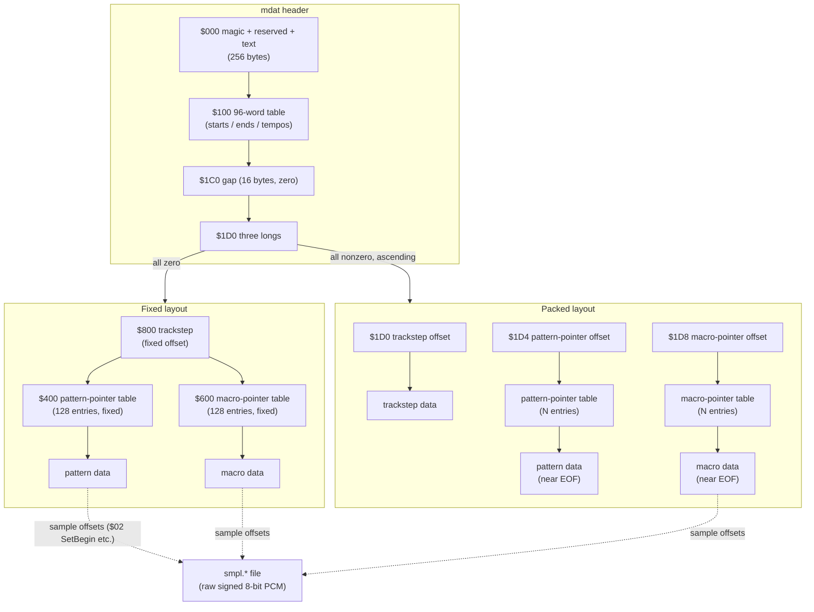

# TFMX File Format — the Data Model

Byte-level layout of the two files that make up a TFMX Professional 2.0 song:
`mdat.*` (header, tables, trackstep, pattern and macro data) and `smpl.*`
(raw sample data). This document covers *where the bytes are and what they
mean structurally*; for what each pattern/macro opcode *does*, see
[`opcodes.md`](opcodes.md).

**Sources**: J. H. Pickard, *The TFMX Professional 2.0 Song File Format*
(the authoritative spec, cited as **[S1]** below, from libxmp; line numbers
refer to the fetched copy of the spec text used for this step), and the
worked macro-dump example in the `playback-tfmx` project README prose notes
(cited as **[S2]**, used only to sanity-check operand layouts).
**[C]** marks a claim verified directly against the byte-level test corpus
in `testdata/` (see `testdata/README.md` for which file is which layout
variant). No replayer source code was read — every existing TFMX replayer is
GPL-2.0 and this crate is written from the published spec so it can stay
MIT/Apache-2.0.

All multi-byte fields are **big-endian**, matching the 68000 host. Hex values
carry a `$` prefix, matching [S1]'s own convention.

---

## 1. The two files

A TFMX song is a pair of files, conventionally named `mdat.<title>` and
`smpl.<title>`:

- **`mdat.*`** — "module data": the header, the 96-word song table, the
  trackstep, and the pattern and macro programs. This is the file described
  in full below.
- **`smpl.*`** — raw sample data referenced by absolute byte offset from
  macro opcodes (`$02 SetBegin`, `$03 SetLen`, `$18 Sampleloop`, `$19 Set one
  shot sample` — see [`opcodes.md`](opcodes.md)). [S1] never gives `smpl` a
  header or magic number of its own; §8 below covers what the corpus shows
  instead.

---

## 2. `mdat` header ($0–$1DB)

### 2.1 Fixed fields ($0–$FF)

[S1] §1 (lines 45–51):

> The first thing in a TFMX mod is the magic number. "TFMX-SONG ". (Note
> the trailing space!) After that there is a word which seems to have no
> real meaning, and you can just leave it 0. The next bit is a long which
> also has no meaning to the player and can be 0 as well. (In earlier
> versions there was a PAL/NTSC flag hidden in here.)
>
> Following this is 240 bytes which is a 40x6 text area.

```
offset   size   field                content
------   ----   -----                -------
$000     10     magic                "TFMX-SONG " (ASCII, trailing space significant)
$00A      2     (reserved)           no meaning to the player; may be nonzero in practice [C]
$00C      4     (reserved)           no meaning to the player; PAL/NTSC flag in early versions [S1]
$010    240     free-text area       40 columns x 6 lines, space-padded ASCII
$100      -     end of fixed header  (96-word table follows, see 2.2)
```

`10 + 2 + 4 + 240 = 256 = $100` bytes, matching [S1] line 53: "After this
256 bytes of information there is a table of 96 words." **[C]** Every file
in the corpus (10/10) starts with the exact magic `"TFMX-SONG "`. **[C]**
Contrary to "can just leave it 0", the reserved word at `$A` is `$0001` in
every corpus file checked, and the reserved long at `$C` is nonzero and
file-specific (e.g. `$00001090` in `mdat.turrican intro`, `$00000E50` in
`mdat.turrican 2 level 1-desert`) — consistent with "no meaning to the
player" (the TFMX editor writes something there; a parser must not depend on
its value) but not with "can be 0", which only describes what a
from-scratch writer may put there. The free-text area is genuinely free text
in the corpus: an artist/date/time block in some files (e.g. `"Date : 23.01.91 ... Time : 17:56"`
in `mdat.turrican 2 level 1-desert`), or a placeholder like `"(Empty)"`
(`mdat.turrican intro`).

### 2.2 The 96-word table ($100–$1BF)

[S1] §1 (lines 53–58):

> After this 256 bytes of information there is a table of 96 words. The
> first 32 of these are song start positions. The next 32 are song end
> positions. The last 32 are tempo numbers. If the tempo number is greater
> than 15, it is used as a beats-per-minute figure, with a beat taking 24
> jiffies. If not, then it is used as a divide-by value into a frequency of
> 50Hz. (0=50Hz, 1=25Hz, 2=16.7 Hz...)

```
offset   size   field                content
------   ----   -----                -------
$100     64     song start table     32 words; trackstep line index where song N begins
$140     64     song end table       32 words; trackstep line index where song N ends
$180     64     tempo table          32 words; see interpretation below
$1C0      -     end of table         ($100 + 96*2 = $1C0)
```

Tempo word interpretation (per-slot, [S1] lines 55–58):

| value       | meaning                                                      |
|-------------|---------------------------------------------------------------|
| `> 15`      | beats-per-minute; one beat = 24 jiffies                       |
| `<= 15`     | divisor into 50 Hz: `0`→50 Hz, `1`→25 Hz, `2`→16.7 Hz, ...     |

**[C]** `mdat.turrican intro`'s tempo slots read mostly `$0005` with a couple
of `$0003`, `$0078` (120), `$00A0` (160) — small values (divisor mode) mixed
with values `> 15` (BPM mode), consistent with the branch above. Song
start/end slots hold small ascending trackstep-line indices in both sample
files checked, consistent with "song start/end position".

### 2.3 The unexplained gap ($1C0–$1CF)

**Uncertain** — [S1] does not describe these 16 bytes at all; the 96-word
table ends at `$1C0` and the packed-layout pointer table (§3) begins at
`$1D0`. **[C]** In all 10 corpus files, bytes `$1C0`–`$1CF` are all zero.
Treat as reserved/padding; a parser should not assume it is always zero
beyond what this corpus shows, since [S1] gives no contract for it.

---

## 3. Layout variants and detection

[S1] §1 (lines 60–68):

> Packed modules:
> At offset $1D0 there is a table of three longs which are offsets into the
> file. They point to (in this order) the trackstep, the pattern data
> pointers, and the macro data pointers. Customarily the pattern data
> pointers and the macro data pointers are at the end of the file.
>
> Unpacked modules:
> The three longwords at $1D0 are null. Fixed offsets of $600,$200,$400
> apply.

```
offset   size   field                          packed layout          fixed layout
------   ----   -----                          --------------          ------------
$1D0      4     trackstep table offset          file offset             $000 (null)
$1D4      4     pattern-pointer table offset    file offset             $000 (null)
$1D8      4     macro-pointer table offset      file offset             $000 (null)
$1DC      -     end of mdat header
```

**Detection is a plain zero check, not a heuristic** — confirmed against the
full corpus **[C]**: the three longs at `$1D0` are either all zero (fixed
layout) or all nonzero, ascending, in-file offsets less than the file size
(packed layout). Nothing ambiguous appears in the 10-file corpus, which
splits 5 packed / 5 fixed:

| file (mdat.\*)                  | `$1D0`     | `$1D4`     | `$1D8`     | layout |
|----------------------------------|-----------:|-----------:|-----------:|--------|
| turrican intro                   | `$00000000`| `$00000000`| `$00000000`| fixed  |
| turrican outside                 | `$00000000`| `$00000000`| `$00000000`| fixed  |
| r-type                           | `$00000000`| `$00000000`| `$00000000`| fixed  |
| x-out (title)                    | `$00000000`| `$00000000`| `$00000000`| fixed  |
| turrican 2 title (st)            | `$00000000`| `$00000000`| `$00000000`| fixed  |
| turrican 2 level 1-desert        | `$000003E8`| `$00003078`| `$000031DC`| packed |
| turrican 2 level 3-flight        | `$00000408`| `$00003584`| `$000036D4`| packed |
| turrican 3 level 1               | `$00000378`| `$00003F20`| `$0000404C`| packed |
| apidya (title)                   | `$00000248`| `$00001A50`| `$00001B28`| packed |
| apidya (level 1)                 | `$00000308`| `$00001E5C`| `$00001F0C`| packed |

### 3.1 Packed layout — pointers are explicit

Each of the three longs is an absolute file offset to its table. Pattern and
macro *data* (not the pointer tables themselves) are typically placed near
the end of the file ([S1] line 64). **[C]** confirmed in
`mdat.turrican 2 level 1-desert` (13024 bytes total): trackstep at `$3E8`
(1000), pattern-pointer table at `$3078` (12408), macro-pointer table at
`$31DC` (12764) — ascending and all inside the file, with the pointer *data*
they contain (pattern/macro program bytes) living further back, around
`$A48`–`$22EB`.

### 3.2 Fixed layout — spec offsets do not match the corpus

[S1] states fixed offsets `$600, $200, $400`, read positionally against the
"(in this order) the trackstep, the pattern data pointers, and the macro
data pointers" sentence immediately above it — i.e. trackstep=`$600`,
pattern pointers=`$200`, macro pointers=`$400`.

**[C] This is contradicted by every one of the 5 fixed-layout corpus files.**
Byte-level inspection (ascending-longword-run scan plus direct decode) of
`mdat.turrican intro`, `mdat.turrican outside`, `mdat.r-type`,
`mdat.x-out (title)`, and `mdat.turrican 2 title (st)` shows, consistently:

- `$200`–`$3FF` (512 bytes): **entirely zero** in all 5 files — not a
  pointer table at all.
- `$400`–`$5FF` (512 bytes = 128 longs): an ascending run of valid in-file
  offsets. This matches [S1] §3 (line 104), which — independently of the
  `$600,$200,$400` sentence — states outright: *"The longword at $1D4 is an
  offset to the pattern pointers (if it is null, $400 is used)."* Combined
  with "maximum of 128 patterns per song file" (line 107), a fixed 128-entry
  table exactly spans `$400`–`$600`. **This is the pattern-pointer table.**
- `$600`–`$7FF` (512 bytes = 128 longs): immediately continues the same
  ascending run (verified with a longword-run scan; e.g.
  `mdat.turrican intro` has one unbroken run of 256 ascending longs from
  `$400` to `$800`). By table-size symmetry with the pattern table and by
  elimination (see below), **this is the macro-pointer table** — a 128-entry
  table, though [S1] never states a numeric max for macros the way it does
  for patterns (**Uncertain**, inferred from the corpus only).
- `$800` onward: trackstep. **[C]** confirmed by content, not just position
  — `mdat.turrican intro` at `$800` reads `EFFE 0004 0000 0005 FF00 FF00 ...`,
  i.e. an `$EFFE` trackstep command line (`$0004` = start master-volume
  slide, see [`opcodes.md`](opcodes.md)) followed by `$FF00` "track stopped"
  words; `mdat.r-type` at `$800` reads `0800 FF00 FF00 ... 0700 0600 ...`,
  plain pattern/transpose words. Both are exactly the trackstep record shape
  from §4.

So the fixed-layout table offsets that the corpus actually exhibits are
**pattern pointers = `$400`, macro pointers = `$600`, trackstep = `$800`**,
each fixed to 128 entries (512 bytes) for the two pointer tables. This
directly matches [S1]'s own §3 fallback statement for pattern pointers, but
contradicts the `$600,$200,$400` sentence in §1. Possibilities: an
editorial error in [S1], or a `$200`-based layout used only by module
sub-versions not present in this corpus (all 10 corpus files, including the
1990-era `turrican intro`, use the `$400/$600/$800` scheme). **A parser
targeting this corpus must use `$400/$600/$800`, not `$600/$200/$400`.**

---

## 4. Pointer graph



---

## 5. The trackstep

[S1] §2 (lines 74–86):

> The trackstep contains all the sequencing information as far as which
> patterns get started when. It is an array of 8 word records, one for each
> track. The high byte of each word contains the pattern number, which will
> be transposed by the two's-complement value in the least significant
> byte; or $80 if the last position is to be held (transpose is set to the
> least sig. byte as above); or $FF if the channel is to stop running; or
> $FE to stop the voice indicated in the least significant byte of the
> command.
>
> When the first word of a line is $EFFE, no track data is loaded. At that
> point, the entire line is used as a command.

Each **line** is 16 bytes = 8 words, one per track:

```
 byte 0        byte 1
+------------+------------+   one word per track, 8 tracks per line
| hi: cmd    | lo: param  |
+------------+------------+

hi byte value        meaning                          lo byte
--------------        -------                          -------
$00-$7F               pattern number (transpose word)   two's-complement transpose
$80                    hold last position                transpose (same encoding)
$FE                    stop voice                        voice number
$FF                    stop channel                      (don't care)
$EFFE (whole line)     line is a command, not track data see below
```

**[C]** confirmed against `mdat.turrican 2 level 1-desert` at its trackstep
offset `$3E8`: `FF00 FF00 FF00 FF00 FF00 FF00 FF00 FF00` (all 8 tracks
stopped) followed by a line `0000 0100 FF00 FF00 FF00 FF00 FF00 FF00`
(track 0 → pattern `$00` transpose `$00`, track 1 → pattern `$01` transpose
`$00`, tracks 2–7 stopped) — exactly the word shape above.

`$EFFE` line commands (word 0 = `$EFFE`, word 1 = sub-command, remaining
words = parameters) are listed in full in [`opcodes.md`](opcodes.md) §1;
this document only establishes the record shape.

---

## 6. Pattern data

[S1] §3 (lines 104–121):

> The longword at $1D4 is an offset to the pattern pointers (if it is null,
> $400 is used). The pattern pointers are a series of longword offsets into
> the MDAT file. At each of these offsets begins a pattern. There is a
> maximum of 128 patterns per song file.
>
> Patterns are a series of longwords. Each longword may be a note or a
> command. The upper two bits indicate what kind of note or command it is,
> and the function of the least significant byte of the command:
>   00: type=note, lsb=detune
>   01: type=note, lsb=detune
>   10: type=note, lsb=wait
>   11: type=portamento or command, lsb=rate

Each pattern entry is one 4-byte longword. The top two bits of **byte 0**
classify it:

```
 byte 0                byte 1        byte 2        byte 3
+----+-----------+    +--------+    +--------+    +--------+
| B7B6 |  B5..B0 |    |  note  |    | vol/v  |    | detune |   (B7B6 = 00 or 01)
+----+-----------+    |  macro |    | c | v  |    | or wait|
                       +--------+    +--------+    +--------+

B7B6 (byte0 top 2 bits)   byte0 low 6 bits   byte1        byte2 (nibbles c,v)   byte3
------------------------   ----------------   ----------   --------------------   -----
00 ($00-$3F)               note number         macro #      c=rel. volume,        detune
01 ($40-$7F)                (0-EF, low 6 bits   (low 6                v=?          (finetune)
                             significant)       bits sig.)
10 ($80-$BF)               note number          macro #      c=rel. volume, v=?    wait
                                                                                    (jiffies-1)
11 ($C0-$FF)               $C0-$EF: portamento-to-note; $F0-$FF: command (see opcodes.md)
```

The note record shape ("A note is of the form aa bb cv dd", [S1] lines
184–189) and the `$F0`–`$FF` command table are given in full in
[`opcodes.md`](opcodes.md) §2. **Uncertain**: [S1] never explains the `v`
nibble in byte 2 (`cv`) beyond naming it; [`opcodes.md`](opcodes.md) records
this as unresolved too.

**[C]** decoded the first pattern in `mdat.turrican 2 level 1-desert`
(pointer table at `$3078` → first entry `$00000A48`):

| bytes            | byte0 top 2 bits | decode                                             |
|------------------|:---:|-----------------------------------------------------|
| `98 2F 50 07`     | `10` | note `$18`, macro `$2F`, c=`5`,v=`0`, wait `7+1=8`  |
| `F1 00 00 00`     | `11` | command `$F1` Loop, aa=`$00` (infinite), target `$0000` (start of pattern) |
| `F0 00 00 00`     | `11` | command `$F0` End                                   |
| `F3 03 00 00`     | `11` | command `$F3` Wait, `3+1=4` jiffies                  |
| `1F 30 52 00`     | `00` | note `$1F` (< `$80`: immediate-fetch/finetune mode), macro `$30`, c=`5`,v=`2`, detune `$00` |

All five decode to structurally valid records under the classification
above, cross-checked against the byte0-range rule in [S1] lines 191–194
("If aa is less than $80 ... ee will be used as a finetune value ... if aa
is greater than $BF, TFMX will portamento").

---

## 7. Macro data

[S1] §4 (lines 200–203):

> The macro data is much like the pattern data, i.e. it is a series of
> longwords pointed to by a table of offsets. However, owing that it has a
> different purpose and different requirements, a few things are slightly
> different.

Unlike pattern longwords, every macro longword uses the **same** shape —
one opcode byte followed by three operand bytes, with no top-bit
classification:

```
 byte 0        byte 1        byte 2        byte 3
+------------+------------+------------+------------+
|  opcode    |     operand bytes (aa, bb bb, or       |
|  $00-$29   |     aa aa aa, depending on opcode)     |
+------------+------------+------------+------------+
```

The full `$00`–`$21` opcode table (with `$22`–`$29` marked unresolved, per
[S1] lines 333–335) is in [`opcodes.md`](opcodes.md) §3.

**[C]** decoded the first macro in `mdat.turrican 2 level 1-desert`
(pointer table at `$31DC` → first entry `$000022EC`), cross-checked against
[S2]'s worked example (which shows the identical opcode sequence
`00,02,03,0D,08,01,04,19,...` for a different song, confirming the general
shape rather than these exact values):

| bytes            | decode                                                              |
|------------------|----------------------------------------------------------------------|
| `00 00 00 00`     | `$00` DMAoff+Reset, aa=`$00`                                        |
| `02 00 57 94`     | `$02` SetBegin, 24-bit operand `$005794` (22420, within the 39.3 KB `smpl.*` file) |
| `03 00 01 D1`     | `$03` SetLen, 16-bit operand `$01D1` (465 words = 930 bytes)        |
| `0D 00 00 14`     | `$0D` AddVolume, aa=`$14`                                            |
| `08 00 00 00`     | `$08` AddNote, transpose `$00`, finetune `$0000`                    |
| `01 00 00 00`     | `$01` DMAon                                                          |
| `04 00 00 00`     | `$04` Wait, `$0000` jiffies                                         |
| `19 00 00 00`     | `$19` Set one shot sample                                            |
| `07 00 00 00`     | `$07` STOP                                                           |

This matches [S1]'s per-opcode operand layouts exactly (see
[`opcodes.md`](opcodes.md) for the byte-meaning of each field).

---

## 8. Sample data (`smpl.*`)

[S1] gives `smpl` no header or magic of its own; it is referenced purely by
byte offset from macro opcodes `$02 SetBegin` (add a 24-bit offset to the
sample base and load into Paula), `$03`/`$12 SetLen`/`AddLen` (Paula length
register, one count = 2 bytes), `$18 Sampleloop` (adds to start, subtracts
from length — sets up the *loop* region of an already-playing sample), and
`$19 Set one shot sample` ("Loads the null sample into the appropriate
registers", [S1] lines 302–303).

**Uncertain / inferred, not stated outright in [S1]**: the sample format
itself. [S1] never states "signed 8-bit" in so many words; this is standard
knowledge for the Amiga Paula chip, which the format targets exclusively
(Paula's DMA sample channels are 8-bit signed PCM, mono, no compression).
**[C]** `smpl.*` files in the corpus have no discernible header: both
`smpl.turrican intro` and `smpl.r-type` begin with 4 zero bytes and continue
with byte values spread across the full `$00`–`$FF` range with no obvious
structure — consistent with raw signed-8-bit PCM audio and inconsistent
with a text/magic header. Both sampled files also *start* with `00 00 00
00`, suggesting (not stated by [S1]) that offset `$0` conventionally holds
a short silent "null sample", matching what `$19 Set one shot sample`
would need to point at.

**One-shot vs. loop** is a two-stage *macro program* technique, not a
static per-sample flag in the file:

1. `$02 SetBegin` + `$03 SetLen` point Paula at the sample's initial
   ("attack") region and start it playing (one-shot: Paula plays it once
   through, whatever the DMA loop wraparound does, until the macro updates
   the registers again).
2. `$18 Sampleloop` is issued (typically after an `$1A Wait on DMA` for the
   attack portion to finish) to repoint Paula's start/length at the *loop*
   region within the same underlying sample — this is what makes the sample
   sustain indefinitely, exploiting Paula's hardware DMA-restart-at-loop-
   point behavior. [S1] does not spell out the hardware mechanism; this
   description follows directly from what `$02`/`$03`/`$18` are documented
   to do to Paula's registers, per [`opcodes.md`](opcodes.md).
3. `$19 Set one shot sample` loads a distinct, presumably-silent "null"
   sample — used to cut a voice off without an audible click, standing in
   for "no sample" since Paula has no explicit off switch short of DMA
   disable (`$00`/`$13`).

---

## 9. Open questions (summary)

- The 16-byte gap at `$1C0`–`$1CF` (§2.3): always zero in the corpus, no
  documented purpose in [S1].
- [S1]'s fixed-layout offsets `$600,$200,$400` (§3.2) are contradicted by
  every fixed-layout file in the corpus, which instead uses
  `$400` (pattern ptrs) / `$600` (macro ptrs) / `$800` (trackstep).
- The 128-entry size of the fixed-layout macro-pointer table is inferred
  from the corpus only; [S1] states the 128-pattern maximum explicitly but
  never gives a macro maximum.
- The `v` nibble in a pattern note record's third byte (`cv`) is named but
  never explained in [S1] (§6, and see [`opcodes.md`](opcodes.md)).
- The reserved word at `$A` and long at `$C` in the header (§2.1): [S1]
  says both are meaningless to the player; the corpus shows both are
  routinely nonzero, so a parser must skip rather than validate them.
- `smpl.*`'s signed-8-bit PCM format (§8) is inferred from Paula hardware
  knowledge and corpus byte statistics, not stated by [S1].
