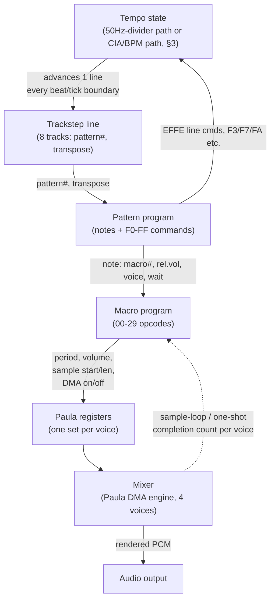
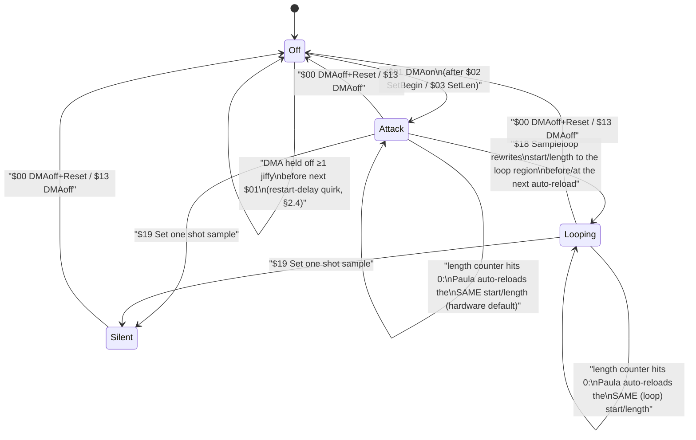

# TFMX Playback Model — how sound is produced

How a decoded `mdat`/`smpl` pair (see [`format.md`](format.md)) turns into
audio: the trackstep→pattern→macro→Paula→mixer signal chain, Paula voice
semantics, the timing model, the note table, and the envelope/vibrato/
portamento maths. For *what each opcode's bytes mean*, see
[`opcodes.md`](opcodes.md); this document is about what happens when those
opcodes run, tick by tick.

**Sources**: J. H. Pickard, *The TFMX Professional 2.0 Song File Format*
(the authoritative spec, cited **[S1]** below, from libxmp), and the worked
macro-dump / TFMX-7V prose from the `playback-tfmx` project README (cited
**[S2]**, used only as corroboration, never as a source of new facts). General
Amiga Paula hardware knowledge is marked **[HW]** — it is not stated in [S1]
but is common, publicly documented behavior of the chip the format targets
exclusively. Statements this document derives by arithmetic from numbers
[S1] does state are marked **inferred**. Where neither [S1] nor solid
hardware knowledge settles a question, it is marked **Uncertain**, following
the convention in the sibling docs — no invented constant, formula, or
ordering is presented as fact. No replayer source code was read; every
existing TFMX replayer is GPL-2.0 and this crate is written from the
published spec so it can stay MIT/Apache-2.0.

Hex values carry a `$` prefix. All multi-byte fields are big-endian.

---

## 1. The signal chain

One **jiffy** (defined precisely in §3) is the player's tick. Once per
jiffy, the following runs top to bottom for every active track/voice:

1. **Trackstep** supplies, per track, which pattern is running and its
   transpose (§5 of [`format.md`](format.md)). It only changes when a new
   trackstep line is consumed — which happens under control of the tempo
   (§3 below), not every jiffy.
2. **Pattern program** advances one step when its wait counter reaches
   zero, playing notes (each naming a **macro** to play them with, a
   relative volume, a voice, and a per-note wait) and executing pattern
   commands (`$F0`–`$FF`, [`opcodes.md`](opcodes.md) §2).
3. **Macro program** advances every jiffy the voice's `<Wait>` counter
   allows, writing Paula register values (period, volume, sample
   pointer/length, DMA on/off) and running the frequency/volume effects
   (vibrato, portamento, envelope, pointer vibrato) described in §5–§6
   below.
4. **Paula registers**, one set per voice (period, volume, sample start,
   sample length, DMA enable), hold whatever the macro program last wrote.
5. **Mixer** is the component that actually walks Paula's DMA per voice at
   audio-sample rate, using whatever register values are currently latched,
   and sums the four voices to output. It is also the only component that
   *knows* when a sample has finished playing through — and macro opcode
   `$1A <Wait on DMA>` needs exactly that fact fed back to it (§6, and the
   Gotchas section). This is the one edge in the chain that runs backwards.



The dashed edge is the feedback path: the mixer must expose, per voice, how
many times the currently-latched sample region has completed (looped or
finished one-shot playback) so that macro opcode `$1A` can be implemented at
all — see §6 and the Gotchas section.

---

## 2. Paula voice semantics

Each of Paula's four hardware DMA channels — one per voice as TFMX uses
them (7V mode combines four *virtual* voices per hardware channel and is out
of scope here, per [S2]'s note that "the file formats are vastly
different") — exposes the same four writable quantities the macro opcodes
target directly:

| Paula concept        | written by                          | range/formula |
|-----------------------|--------------------------------------|----------------|
| period (pitch)        | `$08/$09/$17/$1F` AddNote/SetNote/Set period/SetPrevNote, and the portamento/vibrato effects | see below |
| volume                | `$0D/$0E` AddVolume/SetVolume, and the envelope effect | `$00`–`$40` (0–64), **[HW]** |
| sample start pointer   | `$02 SetBegin`, `$18 Sampleloop`, `$11 AddBegin` | absolute `smpl` offset |
| sample length          | `$03 SetLen`, `$12 AddLen`, `$18 Sampleloop`      | word count (1 count = 2 bytes) |
| DMA enable             | `$00/$13` off, `$01` on                           | on/off |

### 2.1 Period → frequency

`freq_hz = 3_546_895 / period` **[HW]** — 3,546,895 Hz is the PAL Paula
reference clock (the constant behind every Amiga tracker's period table).
[S1] never states this constant; it is standard knowledge for the chip the
format is written for. A period of, e.g., `$01A8` (424) gives
`3_546_895 / 424 ≈ 8365 Hz` — matches [S1]'s "$1E=middle C (8363Hz)" to
within rounding (see §5 for the note→period derivation that produces 424 in
the first place).

### 2.2 Volume

Paula's `AUDxVOL` register is nominally `$00`–`$40` (0–64) **[HW]**; the
top bit of the 7-bit register (values `$41`–`$7F`) is documented Amiga
hardware behavior to also mean "full volume" rather than wrapping or
distorting, but a conforming writer should simply clamp to `$00`–`$40` and
never rely on that overflow behavior. This matches the arithmetic actually
used by `$0D <AddVolume>`, whose `×3` scaling **[S1]**, combined with the
pattern note record's 4-bit relative-volume nibble (`$0`–`$F`), tops out
exactly at `$F × 3 = $2D` (45) — inside the `0`–`64` range with headroom
above it for `$0D`/`$0E`/`$0F` to use directly.

### 2.3 DMA on/off, one-shot-then-loop

Turning a voice's DMA on (`$01`) latches whatever start/length are
currently set (`$02`/`$03`) and Paula begins fetching from there. Paula's
hardware behavior — automatic reload of the *same* start/length when the
length counter hits zero — is what makes a TFMX instrument's "attack, then
loop" shape possible without a second DMA-off/DMA-on cycle **[HW]**:

1. `$02 SetBegin` + `$03 SetLen` point Paula at the **attack** region and
   `$01 DMAon` starts it. Paula will play this region once, and then —
   because Paula does not know the difference between "one-shot" and
   "loop" at the hardware level — automatically restart from the same
   start/length, i.e. **the attack region itself would loop** if nothing
   else happens.
2. Before (or exactly as) that automatic restart happens, `$18
   <Sampleloop>` rewrites start/length to the **loop region** — this is
   *how* one-shot-then-loop is implemented: not a hardware flag, but timing
   the register rewrite to land before Paula's next automatic reload, so
   the reload picks up the loop region instead of repeating the attack.
   [S1]'s wording for `$18` ("adds `aaaaaa` to the sample start and
   subtracts `aaaaaa` from the sample length") is consistent with this: the
   loop region is expressed as an offset *from* the attack region already
   loaded, not as an independent absolute address.
3. `$19 <Set one shot sample>` loads a distinct "null" sample — the
   documented way to silence a voice without an audible click, since Paula
   itself has no soft-mute short of a DMA-disable [S1].

### 2.4 The DMA restart-delay quirk

**[HW]**: disabling a voice's DMA and re-enabling it back-to-back does not
reliably restart playback exactly at the newly-written start address —
Paula's internal prefetch needs the DMA to have been off for a short
interval (on the order of one sample fetch) before the new pointer is
guaranteed latched; toggling DMA off/on inside the same jiffy is not safe.
This is presumably *why* macro `$00 <DMAoff+Reset>` with `aa = 0` is
specified to stop the voice sequencer for a full jiffy before continuing
([S1]: "the voice sequencer stops for a jiffy") rather than letting the next
command run in the same tick — [S1] never states the hardware reason, but
the one-jiffy stall lines up exactly with what the quirk requires. Treat
"stop DMA, then leave at least one jiffy before turning it back on with new
register values" as the safe pattern; `aa ≠ 0` (immediate stop, next
command runs right away) is for cases where the caller does not intend an
immediate restart.

### 2.5 Voice DMA lifecycle



---

## 3. Timing

This is the section a working-but-wrong-speed player gets wrong. Read it
end to end before implementing.

### 3.1 The jiffy

A **jiffy** is one player tick. [S1]'s tempo-table wording defines it via
the divisor path: "divide-by value into a frequency of 50Hz" — so a jiffy
is, by definition, **1/50 of a second at the nominal (divisor = 0) rate**.
Treat this 50 Hz as a fixed logical constant of the *format*, not a
property of any real display: a portable player has no vertical blank to
synchronize to, and should not try to reproduce the PAL/NTSC 50 Hz/60 Hz
video-frequency difference real Amiga hardware would introduce — doing so
would make the same module play at different tempos depending on an
irrelevant detail of the host. **[HW + inferred]**: on real Amiga hardware
the vertical-blank interrupt this ultimately derives from *does* run at
50 Hz on PAL machines and 60 Hz on NTSC — which is exactly the trap
described in the Gotchas section below; a modern implementation sidesteps
it entirely by treating 50 Hz as a constant.

`24 jiffies = 1 beat` [S1] is the second half of the jiffy definition,
needed for the BPM path below.

### 3.2 Two tempo paths, selected per value

TFMX has **two independent ways to derive the jiffy rate**, and a given
tempo value picks exactly one, by magnitude — there is no ambiguity once
you have the number [S1]:

| stored tempo value `v` | path | jiffy rate formula |
|---|---|---|
| `v ≤ 15` (`$0`–`$F`) | **50 Hz-divider path** | `tick_rate_hz = 50 / (v + 1)` |
| `v > 15` (`$10` and up) | **CIA/BPM path** | `tick_rate_hz = v × 24 / 60` |

This rule applies to each of the 32 slots in the `mdat` header's tempo
table (`format.md` §2.2) independently — one song file can have some slots
below 16 and some above, and each is self-describing; there is no separate
flag. **To decide which path a given tempo slot uses, read the 16-bit
value and compare it to 15. That is the entire decision procedure.**

Worked examples:

- `v = 0` → `50 / (0+1) = 50 Hz` (the nominal rate, matches "0=50Hz" [S1]).
- `v = 2` → `50 / 3 ≈ 16.7 Hz` (matches [S1]'s own worked value "2=16.7Hz",
  confirming the formula).
- `v = 125` (`$7D`, > 15, so BPM path) → `125 × 24 / 60 = 50 Hz` — **the
  two paths coincide exactly at 125 BPM / divisor 0.** This is a useful
  sanity check when testing an implementation: a tempo table using `$007D`
  and one using `$0000` must produce audibly identical playback speed.
- `v = 140` (BPM path) → `140 × 24 / 60 = 56 Hz`.

### 3.3 Runtime tempo changes (`$EFFE 0002 SetTempo`)

The trackstep command `$EFFE 0002` ([`opcodes.md`](opcodes.md) §1) carries
**two separate parameter words** — `line+4 = divisor`, `line+6 = CIA bpm`
(`$FFFF` = "no change") — unlike the header table's single dual-purpose
word. [S1] states both fields' meanings but never states which one is
"active" when both are set to non-sentinel values in the same command, nor
whether setting `divisor` implicitly switches playback back to the 50 Hz
path. **Uncertain.** The only precedence rule [S1] gives anywhere is the
header table's per-value threshold (§3.2); it is not restated for this
runtime command. A conservative, clearly-flagged reading: apply `CIA bpm`
as the active rate whenever it is not `$FFFF`; otherwise apply `divisor`
against the 50 Hz base. Do not treat this as documented — it is this
document's best guess for an unstated case, not a citation.

### 3.4 Tick clock vs. output sample rate and render block size

A caller renders audio in blocks of `n` samples at a fixed sample rate
`sample_rate` (e.g. 44100 Hz) it chooses; the player has no say in `n`. The
tick clock (§3.2) and the sample clock are two independent clocks that must
be kept phase-locked without drifting apart over a multi-minute song.

**Samples per tick**, as an exact fraction (keep it a fraction — do not
round to a float and accumulate error):

- 50 Hz-divider path: `samples_per_tick = sample_rate × (divisor + 1) / 50`
- CIA/BPM path: `samples_per_tick = sample_rate × 60 / (bpm × 24)`
  `= sample_rate × 5 / (bpm × 2)`

Worked examples:

- `sample_rate = 44100`, `divisor = 0` → `44100 × 1 / 50 = 882` — an exact
  integer; no drift-correction needed at this combination.
- `sample_rate = 48000`, `divisor = 0` → `960` — also exact.
- `sample_rate = 44100`, `bpm = 140` → `44100 × 60 / (140 × 24) = 787.5` —
  **not** an integer. This is the common case, not the exception, once a
  song uses an arbitrary BPM value; an implementation that always rounds to
  788 samples/tick will run measurably slow (roughly 0.06% here, but it
  compounds and is audible as detuning-from-original over a long track, and
  worse at other BPM/sample-rate combinations).

**Scheduling ticks inside a block** — track the *absolute* sample index of
each tick boundary with an exact-rational accumulator, e.g. numerator/
denominator pair `(sample_rate, tick_rate_hz)` reduced or kept as-is; each
tick boundary at output sample index `k` is `boundary(k) = floor(k ×
sample_rate / tick_rate_hz)`. A simple accumulator implementation:

Express `samples_per_tick` as an exact integer fraction `num / den` — never
as a float, and never via a fractional `tick_rate_hz`, which is itself
non-integer on the divider path (`50 / 3 = 16.67 Hz`) and would reintroduce
the very rounding error this avoids:

| path | `num` | `den` |
|---|---|---|
| 50 Hz divider | `sample_rate × (divisor + 1)` | `50` |
| CIA / BPM | `sample_rate × 60` | `bpm × 24` |

Both rows are the `samples_per_tick` formulas above, kept unevaluated. All
arithmetic below is integer.

```
acc = 0                      # remainder accumulator, in units of `den`
next_boundary_offset = 0     # whole samples remaining until the next tick

for each render request of n samples:
    pos = 0
    while pos < n:
        if next_boundary_offset == 0:
            run_one_jiffy_tick()               # advance trackstep/pattern/macro state machines
            acc += num
            step = acc / den                   # integer division
            acc -= step * den                  # acc keeps the remainder for the next tick
            next_boundary_offset = step
        chunk = min(n - pos, next_boundary_offset)
        synthesize(chunk, current_register_state)  # Paula registers unchanged across this chunk
        pos += chunk
        next_boundary_offset -= chunk
```

A tempo change (§3.3) simply reassigns `num`/`den`; leave `acc` alone so the
sub-sample phase carries across the change instead of resetting.

This is a standard Bresenham-style rational accumulator **[HW/engineering
practice, not from S1]** — it guarantees the tick boundaries land at the
mathematically exact sample index in the long run (the remainder in `acc`
never resets to zero and re-drifts), which a running float accumulator does
not guarantee over a multi-minute render.

### 3.5 Tick timeline inside one render block

Concretely, for `sample_rate = 44100`, 50 Hz-divider path with `divisor = 0`
(`samples_per_tick = 882`, exact), and a caller-chosen render block of 1024
samples:

```
absolute sample:   0                        882                 1024        1764
                    |-------------------------|--------------------|----------|
render request 1:  [ segment A: 882 samples  |  segment B: 142    ]
                     using register state       samples, using new
                     from the PREVIOUS tick      register state written
                                                  by the tick fired at 882
                                                                    ^ block 1 ends (1024 samples delivered)
render request 2:                                                  [ segment C: 740 samples,
                                                                       still using the state from
                                                                       the tick fired at 882, block 2
                                                                       starts partway between ticks ]
                                                                    tick boundary 3 is at 1764, i.e.
                                                                    740 samples into block 2 — not
                                                                    at a block boundary at all.
```

The key point the diagram makes: **tick boundaries and render-block
boundaries are unrelated.** A tick can fall in the middle of a block (most
of the time, for any `n` that isn't a multiple of `samples_per_tick`), and
a block can span zero, one, or several tick boundaries depending on how
large `n` is relative to `samples_per_tick`. The player must run its state
machines exactly at each tick boundary — never "once per block" — or pitch
and timing both come out wrong whenever `n` doesn't evenly divide
`samples_per_tick`.

---

## 4. Note table, transpose, detune → period

[S1] §A gives note **names**, not periods or frequencies, anchored by one
statement in §3: **"All notes are based at `$1E`=middle C (8363Hz)."**
Reproduced verbatim (index, name):

```
 00   F#0    0C   F#1    18   F#2    24   F#3    30   F#3!   3C   !F#!
 01   G-0    0D   G-1    19   G-2    25   G-3    31   G-3!   3D   !G-!
 02   G#0    0E   G#1    1A   G#2    26   G#3    32   G#3!   3E   !G#!
 03   A-0    0F   A-1    1B   A-2    27   A-3    33   A-3!   3F   !A-!
 04   A#0    10   A#1    1C   A#2    28   A#3    34   A#3!
 05   H-0    11   H-1    1D   H-2    29   H-3    35   H-3!
 06   C-1    12   C-2    1E   C-3    2A   C-4    36   C-4!
 07   C#1    13   C#2    1F   C#3    2B   C#4    37   C#4!
 08   D-1    14   D-2    20   D-3    2C   D-4    38   D-4!
 09   D#1    15   D#2    21   D#3    2D   D#4    39   D#4!
 0A   E-1    16   E-2    22   E-3    2E   E-4    3A   E-4!
 0B   F-1    17   F-2    23   F-3    2F   F-4    3B   F-4!
```

Reading down each column and across, the index increments exactly one
semitone at a time across the whole table (`$00`→`$0B` is F#0 through F-1,
`$0C` continues at F#1, etc.) — confirmed by the fact that `$1E` lands
exactly on "C-3", which [S1] independently calls middle C. **Only the low 6
bits of the note byte select the note** [S1] — patterns can pass note
values with the top 2 bits used for the note/command classification
(`format.md` §6) without that colliding with note selection. The columns
past index `$2F` (the `!`-suffixed names, `$30`–`$3F`) are not explained
further in [S1] and are not needed for the arithmetic below; treat them as
extra table entries continuing the same linear semitone sequence.

**Note → frequency** (equal temperament, anchored at the one stated
reference point) — **inferred**, not stated as a formula in [S1], but the
standard convention for exactly this kind of note table on Amiga hardware:

```
freq_hz(note) = 8363 × 2^((note − $1E) / 12)
```

**Note → period**, combining with §2.1's Paula constant:

```
period(note) = 3_546_895 / freq_hz(note)
             = 3_546_895 / (8363 × 2^((note − $1E) / 12))
```

Worked example: `note = $1E` → exponent 0 → `freq = 8363 Hz` →
`period = 3_546_895 / 8363 ≈ 424.2` → **424** (rounding convention itself
is not stated by [S1]; round-half-to-even or truncate are both defensible,
pick one and keep it consistent).

Second example: `note = $2A` (one octave above `$1E`, "C-4") → exponent
`(0x2A − 0x1E)/12 = 12/12 = 1` → `freq = 8363 × 2 = 16726 Hz` →
`period = 3_546_895 / 16726 ≈ 212.1` → **212**, exactly half the `$1E`
period, as expected for an octave up.

### 4.1 Transpose

Trackstep transpose and pattern-command transpose (`$08`/`$09`/`$1F`
macro opcodes, `aa` field) are **added to the note index before** the
frequency lookup, per [S1]'s repeated wording "transposed by `aa` (and by
the track transpose if necessary)". Trackstep transpose is a two's-complement
byte (`format.md` §5); apply it as a plain signed addition to the note
index, then run the note→period formula above.

### 4.2 Detune / finetune

Two different fields carry a finetune-style adjustment, at two different
widths:

- **Pattern note record**, byte 3 (`dd`), used only when the note byte
  `aa < $80`: a signed **8-bit** value, stated range **"+/- 50%"** [S1].
- **Macro opcodes `$08`/`$09`/`$1F`** (`AddNote`/`SetNote`/`SetPrevNote`),
  operand `bbbb`: a signed **16-bit** value, with two example points given
  directly by [S1]: `$0000` = 100%, `$0080` = 150%, `$FF80` = 50%.

From the two 16-bit example points: `$0080` = 128 decimal ↦ +50%, and
`$FF80` = −128 (two's complement) ↦ −50%. That is exactly `128 / 256 =
0.5`, i.e. **inferred formula**:

```
multiplier = 1 + (signed_value / 256)
```

This also explains the byte-sized field's independently-stated "±50%"
range without needing a second formula: a signed 8-bit value's extremes
(`±127`) divided by the same `256` give `±0.496`, i.e. essentially the same
±50% [S1] states outright for that field — strong evidence the two fields
share one convention (a Q8.8-style fixed-point fraction), even though [S1]
never says so explicitly. **Uncertain**: whether the multiplier applies to
frequency (raising it, e.g. `freq_final = freq(note) × multiplier`) or
directly to period (`period_final = period(note) / multiplier`, the
frequency-domain reading re-expressed) is not stated; the two are
equivalent given the formula above, so either is safe to implement as long
as it is applied consistently. What is *not* confirmed is whether values
outside the two documented example points (`$0080`/`$FF80`) are meant to be
usable at all, or whether real module data ever exercises them — treat the
formula as validated only at those two points.

Worked example: `note = $1E` (period 424, freq 8363 Hz), `bbbb = $0080`
(+50%): `multiplier = 1.5` → `freq_final = 8363 × 1.5 = 12544.5 Hz` →
`period_final = 3_546_895 / 12544.5 ≈ 282.7` → **283**.

---

## 5. Envelope, vibrato, portamento maths

All three are per-jiffy effects a macro program starts and that keep
running, ticking down independently of the macro program counter, until
explicitly stopped (`$0A <Reset>`, a new note command, or the voice being
killed). Envelope has a target and clamps on arrival; portamento and
vibrato do not — they run until canceled.

### 5.1 Envelope (`$0F` macro `<Envelope>`, `$F7` pattern `<Enve>`, `$FA`
pattern `<Fade>`, `$EFFE 0003/0004` master-volume slide)

All four are the same shape: every `period` jiffies, move `value` by `step`
towards `target`, clamping so it cannot overshoot **(clamp-at-target is a
reasonable operational reading of "slide ... towards ...", not stated
explicitly as a clamp rule by [S1] — inferred)**:

```
$0F <Envelope> aa bb cc:  every bb jiffies, volume += sign(cc - volume) × aa, clamped to cc
$F7 <Enve>     aa bv cc:  every b+1 jiffies, voice v's volume += sign(cc - volume) × aa, clamped to cc
$FA <Fade>     aa xx bb:  every aa jiffies, master volume += sign(bb - master_volume) × 1, clamped to bb
EFFE 0003/0004:            every divisor jiffies, master volume moves by 1 towards target (see opcodes.md — [S1]
                            never distinguishes 0003 from 0004)
```

Worked example: `$0F` with `aa=$05`, `bb=$03`, `cc=$28`, current volume
`$10` (16): every 3 jiffies, volume increases by 5 (16→21→26→31, but
31 > 40=`$28`, so the last step clamps at 40 (`$28`) rather than
overshooting to 31... concretely: 16, 21, 26, 31, 36, then the next step
would be 41 > 40, so it lands at exactly 40 and the envelope stops
advancing.

### 5.2 Vibrato (`$0C` macro `<Vibrato>`, `$F6` pattern `<Vibr>`)

`aa` sets the waveform period (`period_jiffies = 2 × aa`), `bb` is the
signed per-jiffy slide amount. [S1]: "every jiffy slide by `bb`. The
vibrato waveform starts on the rising zero-crossing of a triangle wave.
`2×aa` is the period of this waveform." This document's operational
reading of that prose — **[S1]'s wording is compressed and gives no worked
numeric trace, so treat the exact phase alignment below as this
document's interpretation, not a verbatim-cited fact**:

A standard triangle LFO of period `P = 2×aa` jiffies, slope magnitude `bb`
per jiffy, alternating sign at the two extrema (not at the zero-crossings),
starting at `t=0` on a rising zero-crossing:

```
t_in_cycle = jiffies_since_start mod (2 × aa)
half = aa / 2
if t_in_cycle < half:                       delta =  bb × t_in_cycle
elif t_in_cycle < half + aa:                delta =  bb × (half - (t_in_cycle - half))     # falling through 0, past it, to trough
else:                                        delta = -bb × (2×aa - t_in_cycle)              # rising back to 0
period_effective = base_period + delta
```

If implementing the exact quarter-phase split above is more complexity than
warranted, the simpler two-segment approximation — add `bb` per jiffy for
`aa` jiffies then subtract `bb` per jiffy for `aa` jiffies, oscillating
`0 → aa×bb → 0` — still matches [S1]'s stated `period = 2×aa` and "starts
rising from a zero value" and is a defensible fallback; it does not
reproduce the bipolar "crossing" [S1]'s wording implies. Either way: mark
this as *this document's* reading, verify against real playback before
relying on exact phase.

`$F6 <Vibr>` (pattern) is stated to have "the same effect as macro `$0C`",
applied to an explicit voice number — same maths, different operand
packing (`aa xv bb`, see [`opcodes.md`](opcodes.md)).

### 5.3 Portamento (`$0B` macro `<Portamento>`, `$FC` pattern `<Port>`)

Every `aa` jiffies, multiply the current period by `(256 + bb) / 256`
[S1]. If portamento was not already running, the current period is loaded
in as the starting point first.

```
period_{n+1} = period_n × (256 + bb) / 256      (applied every aa jiffies)
```

Because period is *inversely* related to pitch, **positive `bb` bends the
pitch down** (period grows) and negative `bb` bends it up (period shrinks)
— easy to get backwards when reading "portamento" as "pitch rises with a
positive number."

Worked example: starting period `424` (`$1E`, from §4), `aa = 1` (every
jiffy), `bb = 10`: `period_1 = 424 × 266/256 ≈ 440.4`, `period_2 ≈ 440.4 ×
266/256 ≈ 457.6`, and so on, each step multiplying by the same
`266/256 ≈ 1.0391` ratio. [S1] does not state a rounding convention for
this multiply-and-truncate step either; pick one (truncate is the simplest
and matches typical 68000 fixed-point multiply-then-shift idioms) and apply
it consistently every step, since small rounding differences compound over
many jiffies.

`$FC <Port>` (pattern) is the same maths with an 8-bit-only `bb` field
(`aa xv bb`, one byte) rather than macro `$0B`'s 16-bit `bb` — a real
difference in operand width between the two opcodes' encodings, not a
copy error; see [`opcodes.md`](opcodes.md) for the exact byte layouts.

---

## 6. Gotchas

- **Tempo is the classic failure.** Getting the tick clock wrong produces a
  player that sounds like it's *working* — notes, envelopes, and pattern
  structure all correct — just at the wrong speed, which is exactly why it
  goes unnoticed until someone compares against a reference. Two specific
  ways to get it wrong: (a) picking the wrong path for a tempo value —
  the `v ≤ 15` / `v > 15` split (§3.2) is the *entire* rule, there is no
  other signal to look for; (b) tying the "50 Hz" of the divider path to a
  real display refresh rate instead of treating it as a fixed constant of
  the format (§3.1) — this is the PAL/NTSC trap, and it is silent because
  50 Hz and 60 Hz both produce plausible-sounding music, just ~20% apart in
  tempo.

- **`$80` hold still applies transpose.** [S1]: "`$80` if the last position
  is to be held (transpose is set to the least sig. byte as above)". The
  parenthetical is easy to skip past — `$80` does not mean "ignore this
  word." The currently-running pattern keeps running (no new pattern
  pointer is loaded), but the low byte is still decoded as a two's-complement
  transpose exactly like any other trackstep word, and that transpose takes
  effect from this line onward. Special-casing `$80` as a pure no-op drops
  transpose changes that should apply.

- **`$18 <Sampleloop>` is not idempotent.** Its operand is *added* to the
  sample start and *subtracted* from the sample length — not an absolute
  "set the loop region to X" — so issuing it twice for the same loop
  transition compounds the offset instead of reapplying the same region.
  A macro program must call `$18` exactly once per attack→loop transition
  (§2.3); calling it again later (e.g. from a loop that re-enters the same
  code path) will walk the loop window further from where it started each
  time.

- **`$1A <Wait on DMA>` needs mixer state fed back.** [S1]'s literal
  behavior text ("plays the sample `aaaa` times, then continues") is a
  completion *count*, not a raw wait-for-flag — a macro program can only
  finish this opcode correctly if something tracks how many times the
  currently-latched sample region has completed a play-through (§1's
  feedback edge, §2.3). That tracking lives in the mixer/DMA-engine layer
  (it is the only layer that walks Paula's pointer at audio-sample
  granularity), not in the macro interpreter — the macro interpreter must
  be able to *ask* the mixer "how many completions has voice N seen since I
  last reset the count," and reset it when appropriate (implied by "plays
  ... `aaaa` times", though the exact reset point is not stated). Also note
  the opcode's own name is misleading: [`opcodes.md`](opcodes.md) already
  flags that "Wait on DMA" describes a repeat count, not a DMA-completion
  wait in the usual sense — implement the *stated* behavior, not what the
  mnemonic suggests.

- **Two different offset spaces — do not mix them up.** This is the gotcha;
  the rule is not "everything is absolute".

  1. **Absolute byte offsets into `mdat`** — the pointer-table entries
     themselves (pattern pointers, macro pointers, the trackstep offset) and
     the sample offsets into `smpl`. These are raw file offsets, counted from
     the start of the file, and are what the "offsets are absolute" warning
     is actually about.
  2. **Pattern/macro-relative *step indices*** — the `bbbb` targets of
     jump/loop/gosub opcodes (`$F1`/`$F2`/`$F8` pattern, `$05`/`$06`/`$15`
     macro, and the split-on-value targets `$1C`/`$1D`). These count
     **longwords from the start of the enclosing pattern or macro**, not
     bytes, and not from the start of the file.

  **[C] Verified against the corpus** — all 229 `$F1`/`$F2`/`$F8` commands
  found across the 10 modules: not one has a target ≥ its own pattern's
  longword count (largest target seen is 32; longest pattern is 104
  longwords). Targets take odd values (1, 3, 5, …), which rules out a
  byte-offset reading, since every longword-aligned byte offset would be a
  multiple of 4. An absolute-file reading is nonsense outright: a target of
  32 would land inside the `"TFMX-SONG "` magic. `$F2 <Jump>` settles it on
  its own — it names *both* a pattern number `aa` and a point `bbbb`, so
  `bbbb` must be relative to that pattern or the pattern number would carry
  no information.

  So `format.md` §6's worked decode, which reads an `$F1` target of `$0000`
  as "start of pattern", is correct. A parser that instead resolves these
  targets as absolute file offsets will read garbage past the first jump.

- **Input is untrusted.** `mdat`/`smpl` pairs in the wild are game rips of
  varying provenance and quality, not files produced by a single trusted
  tool. Every offset this document and its siblings describe (pointer
  tables, jump/loop targets, sample start/length) must be bounds-checked
  against the actual file/sample size before being dereferenced — nothing
  in [S1] guarantees internal consistency, and a corrupted or truncated rip
  should fail to load cleanly rather than read out of bounds.

---

## 7. Open questions (summary)

- Which of `divisor` / `CIA bpm` wins when `$EFFE 0002 SetTempo` sets both
  in the same command (§3.3) — [S1] gives no precedence rule for this
  runtime opcode, only for the header tempo table.
- The exact phase/segment shape of vibrato's triangle wave (§5.2) — [S1]'s
  "period = 2×aa, starts on a rising zero-crossing" is taken at face value,
  but no worked numeric trace exists to confirm the quarter-phase reading
  over the simpler two-segment approximation.
- Whether the note/macro finetune multiplier (§4.2) applies to frequency or
  period (equivalent formulas, unconfirmed which domain is canonical), and
  whether values beyond the two documented example points (`$0080`/`$FF80`)
  are ever exercised by real module data.
- The rounding convention for period arithmetic (note→period, portamento's
  per-step multiply) — [S1] states the formulas' inputs but never a
  rounding rule.
*Resolved, previously open:* whether pattern/macro jump targets are absolute
`mdat` offsets or pattern-relative. They are pattern-relative longword step
indices, verified across all 229 jump/loop commands in the corpus — see the
two-offset-spaces gotcha in §6.
