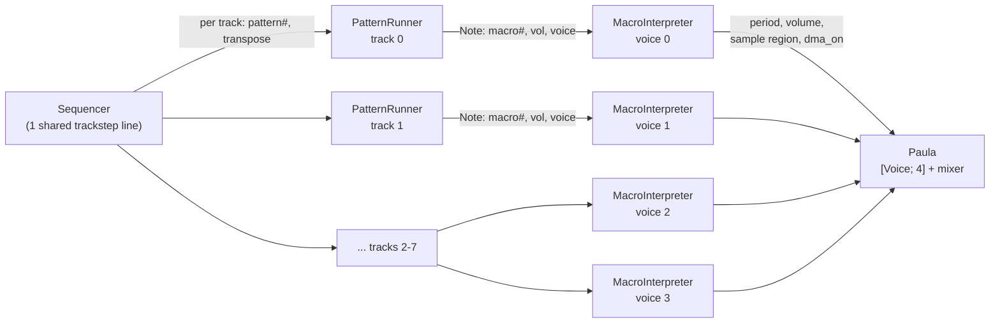
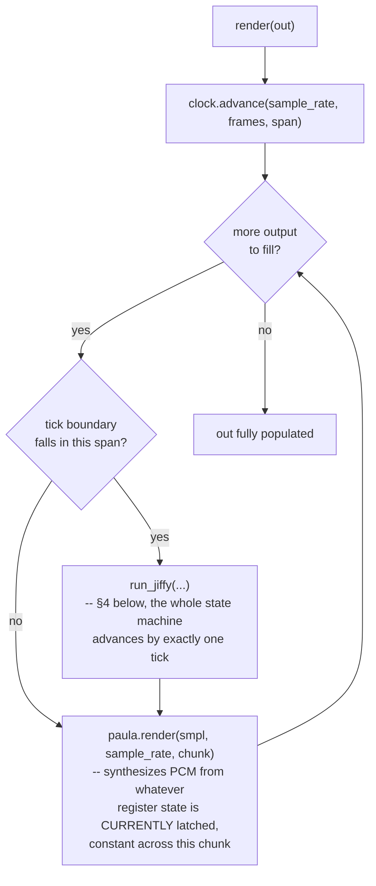
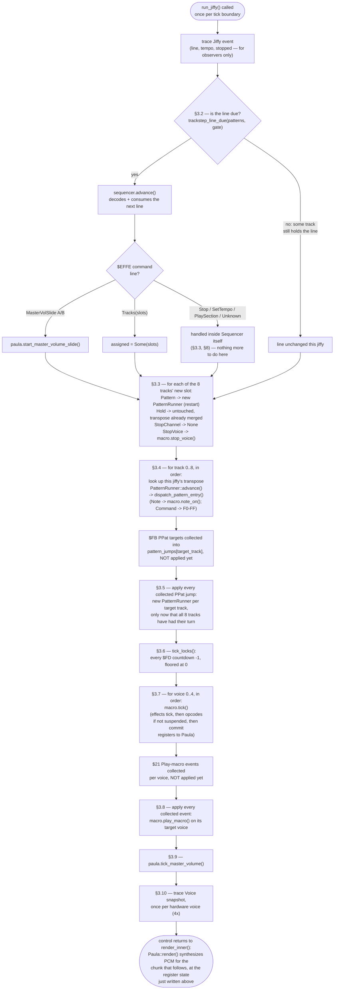
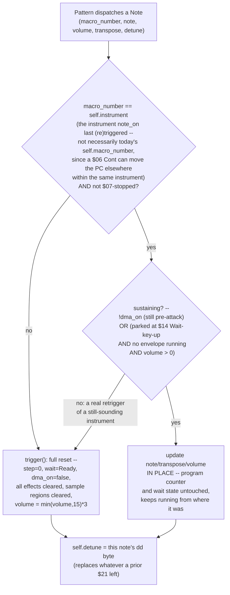

# The Replayer Walkthrough — One Jiffy, Start to Finish

This document connects the pieces the sibling docs describe separately: it walks
[`Player::run_jiffy`](../tfmx/src/player.rs) — the actual, single function that runs the
whole state machine once per tick — top to bottom, in the exact order the code runs it,
and shows how trackstep lines, pattern commands and macro opcodes each plug into that
order. It is example-driven: every worked scenario below is either a real test in this
crate (cited by name and line) or built the same way one would be.

**What this is not.** It does not restate the byte-level opcode reference
([`opcodes.md`](opcodes.md)), the timing/pitch/envelope mathematics
([`playback-model.md`](playback-model.md)), or the crate/type/API design
([`architecture.md`](architecture.md)). Read this document for *order and connection* —
what runs before what, and why that order is load-bearing — and follow the links out to
those three for *what a byte means*, *what formula computes a value*, and *what a type's
contract is*.

---

## 1. The cast

One `Player` owns everything below. Its `render(out)` call is the only thing any caller
(CLI, later a `cpal`/AudioWorklet callback) ever invokes.

| Type | Lives in | Count | Role |
|---|---|---|---|
| `Player` | `player.rs` | 1 | Owns everything else; runs the tick clock; the public `render()` entry point. |
| `TickClock` | `sequencer.rs` | 1 (`Player`'s own) | Schedules *when* a jiffy happens against the output sample rate. See §3 and §8's finding. |
| `Sequencer` | `sequencer.rs` | 1 | The trackstep runner: current line, each track's loaded `(pattern, transpose)`, song start/end/loop, `$EFFE` command handling. |
| `PatternRunner` | `sequencer.rs` | up to 8 (one per track, `Option`) | One pattern program counter, per track. Decodes and executes `$F0`–`$FF` pattern commands and note longwords. |
| `MacroInterpreter` | `macro_interp.rs` | 4 (one per Paula voice, always present) | One macro program counter, per voice. Decodes and executes `$00`–`$21` macro opcodes; owns the running vibrato/portamento/envelope/pointer-vibrato effects. |
| `Paula` | `paula.rs` | 1 (`[Voice; 4]`) | The register file + mixer. Never touches trackstep/pattern/macro state — only the four voices' `period`/`volume`/sample region/DMA-on. |

The trackstep line is **one** shared program counter across all 8 tracks (`Sequencer::line`);
each track has its **own** `PatternRunner` (or `None`, if stopped); each of the 4 voices has
its **own** `MacroInterpreter`. Nothing here is dynamically allocated after `Player::new` —
`patterns: [Option<PatternRunner>; 8]` and `macros: [MacroInterpreter; 4]` are fixed-size
arrays (`architecture.md` §4).



Note the fan-in at the bottom: **any** track can target **any** voice (the note longword's
`v` nibble picks the voice, independent of which track dispatched it — `voice_of()`,
`player.rs:20`). There is no fixed track-to-voice mapping; a module is free to have several
tracks fight over the same voice, and the last one dispatched in a jiffy wins.

---

## 2. Zoomed out: from `render()` to `run_jiffy()`

`Player::render(out)` (really `render_inner`, `render()`/`render_traced()` are thin
wrappers around it — `architecture.md` §2's trace seam) does two things in a loop, driven
by `TickClock::advance`:



`clock.advance` (`sequencer.rs:82`) is the exact-fraction scheduler `playback-model.md`
§3.4 specifies: `run_jiffy` runs precisely at each tick boundary, never "once per block,"
and a render call spanning zero, one, or several tick boundaries all fall out of the same
loop. `architecture.md` §3 has the full sequence diagram and the block-size-independence
contract this is testing (`player.rs`'s
`thirty_second_render_is_sane_and_reproducible` test proves one 30s call is bit-identical
to many small chunked calls). This document only adds one thing that page doesn't: **§8
below is a real gap in how `run_jiffy`'s own tempo changes reach this clock.**

---

## 3. One jiffy, start to finish

Everything in this section is one call to `run_jiffy` (`player.rs:245`), read top to
bottom in the order the function actually executes. This is the "make it legible at a
glance" picture:



### 3.1 The trace point

`trace(TraceEvent::Jiffy { frame, line, tempo, stopped })` fires first, unconditionally.
It is observation only (`architecture.md`'s trace seam) — nothing downstream reads it back.

### 3.2 Is the trackstep line due?

`trackstep_line_due(patterns, gate)` (`player.rs:64`) decides whether this jiffy may
consume a new trackstep line at all — most jiffies, it may not, because a track's pattern
is still running. It counts, across the 8 tracks:

- `holding` — tracks whose `PatternRunner` exists and has **not** halted (still mid-program).
- `ended` — tracks halted specifically on `$F0 <End>`.

A track halted on `$F4 <STOP>`/`$FE` (or with no `PatternRunner` at all — `None`) counts
as neither: it has opted out of the vote entirely, per `$F4`'s own documented semantics
("unrecoverable ... will not run any upcoming `<End>`," `opcodes.md` §2) — otherwise a
stopped track would stall the line forever.

```
AllTracks:  due  <=>  holding == 0                 (every still-running track must have hit $F0)
AnyTrack:   due  <=>  holding == 0 || ended > 0     (one $F0 is enough)
```

`AnyTrack` is the crate default (`TrackstepGate`'s `#[default]`, confirmed against the real
TFMX editor — see the doc comment at `player.rs:24`). **Worked example**, directly from the
tests (`player.rs`'s `two_track_module` fixture: track 0's pattern is `Note; $F0`, halting
at jiffy 1; track 1's pattern is `Note; Wait(3); $F0`, halting at jiffy 4):

| jiffy | track 0 halted? | track 1 halted? | `AllTracks` line advances? | `AnyTrack` line advances? |
|---|---|---|---|---|
| 0 | no | no | no | no |
| 1 | **yes** (`$F0`) | no | no | no |
| 2 | yes | no | no | **yes** — `any_track_gate_advances_on_the_first_track_to_end` |
| 3 | yes | no | no | (already advanced) |
| 4 | yes | **yes** (`$F0`) | **yes** — `all_tracks_gate_waits_for_the_last_track_to_end` | (already advanced) |

Under `AnyTrack`, line 1 starts at jiffy 2 and **truncates** track 1's still-running
pattern; under `AllTracks`, track 1's longer pattern governs and line 1 doesn't start
until jiffy 4. This is exactly what makes a pure-filler pattern (`$F3 <Wait>` then `$F0`,
nothing else) read as either a *pad* (`AllTracks`: the longest track always wins, so
filler never shortens anything) or a *metronome* (`AnyTrack`: filler fixes the line's
length regardless of what any other track is doing) — see `player.rs:38`'s doc comment
for the full reasoning and the editor test that settled it.

If the line *is* due, `sequencer.advance()` decodes and consumes it, returning a
`TrackstepLine`. Two shapes:

- **`Command(LineCommand)`** — an `$EFFE` line. `Stop`/`SetTempo`/`PlaySection` are fully
  handled *inside* `Sequencer::apply_command` (`sequencer.rs:326`) before `advance()` even
  returns — `run_jiffy` never sees their effect directly, only the label, via `trace`.
  `MasterVolSlideA`/`B` are the one exception: `Sequencer` only recognizes and times them
  (it has no `Paula` to write to), so `run_jiffy` pattern-matches the returned value and
  calls `paula.start_master_volume_slide()` itself right here.
- **`Tracks(slots)`** — ordinary per-track data, stashed as `assigned` for §3.3.

### 3.3 Loading new track words

If a new line's `Tracks(slots)` was just consumed, each of the 8 slots is applied to its
track's `PatternRunner`:

| `TrackSlot` | Effect |
|---|---|
| `Pattern { number, .. }` | **Restarts** that track: `patterns[i] = Some(PatternRunner::new(module, number)?)` — always step 0, even if the same pattern number was already running. |
| `Hold { .. }` | Untouched. The transpose value was already merged into `self.tracks[i]` inside `Sequencer::advance` (`sequencer.rs:300`-`308`) before this point, so §3.4's per-track transpose lookup sees the update without `PatternRunner` itself changing at all. |
| `StopChannel` | `patterns[i] = None`. |
| `StopVoice { voice }` | `macros[voice_of(voice)].stop_voice()` — silences a *voice*, independent of which *track* issued it; the track's own `PatternRunner` is untouched. |

Track words are per-line data: this block only runs on the jiffy a new line is actually
consumed, never "continuously" — a track that already has a live `PatternRunner` keeps
running it, uninterrupted, for as many jiffies as the line holds.

### 3.4 Per-track pattern dispatch

For every track `0..8`, in that fixed order: look up the transpose for *this jiffy*
(`sequencer.track(i)`, always freshly read — see §3.3's `Hold` note), then, if a
`PatternRunner` exists for this track, call `PatternRunner::advance`.

`PatternRunner::advance` (`sequencer.rs:615`) either burns down a wait counter (most
jiffies — nothing else happens) or, once it reaches zero, fetches and applies pattern
longwords **in a loop**, up to `MAX_PATTERN_ENTRIES_PER_JIFFY` (1024) per jiffy — the
chain that lets `$F1`/`$F2`/`$F8`/immediate-fetch (detune) notes/flow commands all resolve
within a single jiffy, the way real TFMX pattern data does. Each entry decoded is handed
to `run_jiffy`'s own closure, which calls `dispatch_pattern_entry` (`player.rs:382`):

- **`Note { note, macro_number, volume, voice, timing }`** — if the target voice is
  `$FD`-locked (§3.6), the note is **dropped**, not deferred. Otherwise: extract the
  detune (only meaningful when `timing` is `Detune`, never `Wait`/`Portamento` —
  `playback-model.md` §4), then call `macros[voice].note_on(macro_number, note, volume,
  transpose, detune)` — see §5 for what that call does. `trace(Trigger { .. })` fires
  right here, at the dispatch site, not re-derived later.
- **`Command(PatternCommand)`** — `$F0`–`$FF`. Most route straight through to their
  target's state (`KeyUp` → `signal_key_up()`, `Vibrato`/`Envelope`/`Portamento` →
  `start_*` on the named voice's `MacroInterpreter`, `Fade` → `paula.start_master_volume_slide()`,
  `Lock` → arms the countdown array). `End`/`Loop`/`Jump`/`Wait`/`Stop`/`GoSub`/`Return`/
  `StopCustom`/`Nop` need no action *here* at all — their whole effect already happened
  inside `PatternRunner::apply` (program-counter/wait-counter bookkeeping), which is why
  `dispatch_pattern_entry` returns `None` for all of them. **`PlayPattern` (`$FB <PPat>`)
  is the one exception** — see §3.5.

### 3.5 Cross-track jumps: collect now, apply after every track's turn

`$FB <PPat>` targets a *track*, which may be any of the other 7 (or the issuing track
itself). `dispatch_pattern_entry` does not create the new `PatternRunner` immediately —
it returns `Some((target_track, target_pattern))`, and `run_jiffy`'s track loop stashes
it into `pattern_jumps[target_track]`. Only *after* the `0..8` loop has run every track's
turn for this jiffy does a second loop apply every collected jump.

This single-pass-then-apply ordering is not incidental — it is exactly what
`opcodes.md` §2's stated timing rule needs, for free, with no extra bookkeeping: *"If this
command's own track number is lower than track `a`, the jump takes effect on the next
entry into the play routine; otherwise it is immediate."* Since the collected jump is
never applied before every track (lower or higher-numbered) has already taken its turn
**this same jiffy**, the target track's dispatch this jiffy always uses its *old*
`PatternRunner` — which is "immediate" from the issuing track's point of view whenever the
target hasn't run yet this pass, and "next entry" whenever it already has. Both of
`opcodes.md`'s two cases fall out of one rule.

**Worked example** (`player.rs`'s `play_pattern_command_redirects_the_named_track_on_the_next_jiffy`):
track 0's pattern is `PlayPattern(pattern: 2, track: 1); Wait(0)`; track 1 is already
running pattern 1 (`Note(macro: 5); ...`); pattern 2 plays `Note(macro: 9); ...`.

| jiffy | track 0 dispatches | track 1's `PatternRunner` used this jiffy | macro started on voice 1 |
|---|---|---|---|
| 0 | `PlayPattern(2, track=1)` → `pattern_jumps[1] = Some(2)`, applied *after* this loop | **old** — still pattern 1 (jump not yet applied when track 1 took its turn) | macro 5 |
| 1 | (track 0 idles) | **new** — pattern 2, applied at the end of jiffy 0 | macro 9 |

Track 1's dispatch on jiffy 0 still plays the *old* pattern's note — the jump issued that
same jiffy by track 0 (index 0, lower than target track 1) only takes effect starting
jiffy 1, matching "own track lower than target: next entry into the play routine."

### 3.6 Lock countdown

`tick_locks(lock)` (`player.rs:370`) decrements every voice's `$FD <Lock>` countdown by
one, floored at 0 — run once per jiffy, **after** this jiffy's own pattern dispatch, so a
`Lock` command issued this jiffy still fully blocks other notes targeting that voice this
same jiffy (§3.4 checks `lock[voice] > 0` before the countdown has moved).

### 3.7 Macro tick

For each of the 4 voices, in order: `macro.tick(module, paula, voice, unsupported, emit)`
(`macro_interp.rs:564`). Inside one call, in this order:

1. **Free-running effects tick unconditionally**, even if the macro program itself is
   suspended this jiffy: `portamento.tick(&mut period)`, then `envelope.tick(&mut volume)`
   (dropped once it reports "finished"). This is what makes an envelope started before a
   `$14 <Wait key up>` keep decaying while the program sits parked (§5's "sustain" case
   hinges on exactly this).
2. **`take_turn(paula, voice)`** decides whether opcodes are fetched at all this jiffy —
   it is the state machine behind every macro suspension form: `Wait::Ready` (yes),
   counted `Wait::Jiffies(n)` (burn down, no), `Wait::KeyUp(deadline)` (yes if the release
   flag is set or the deadline hits 0), `Wait::DmaCompletions(target)` (yes once
   `paula.loop_completions(voice) >= target` — the `$1A` feedback path,
   `architecture.md` §2), `Wait::Stopped` (never, until a new `note_on`/`play_macro`).
3. **If opcodes are due**, `execute()` runs in a loop, up to `MAX_MACRO_OPS_PER_JIFFY`
   (1024) per jiffy, exactly the way `PatternRunner` chains entries in §3.4 — this is the
   mechanism behind `opcodes.md`'s `*` suspend marker (§7 below spells out the mapping):
   an opcode marked `*` returns `false` from `execute`, ending the fetch loop for this
   jiffy; an unmarked one returns `true` and the next longword is fetched immediately,
   same jiffy.
4. **Vibrato and pointer-vibrato are folded in** on top of whatever `period`/
   `sample_start`/`sample_len` the opcodes (or lack thereof) left — vibrato adds a delta
   to `period` without mutating the stored value (so it doesn't compound), pointer
   vibrato nudges `loop_start` once loop playback is active or `sample_start` before it,
   mirroring `loop_start`/`loop_len` onto the plain sample fields whenever no `$18` has
   yet handed the voice to a real loop (`macro_interp.rs:596`'s comment explains why: real
   Paula only has one pair of double-buffered registers, so a mid-attack `$11`/`$12`
   change would otherwise be silently discarded at the next auto-reload).
5. **Registers are committed to `Paula`** — `set_period`, `set_volume`,
   `set_sample_region`, `set_loop_region`, `set_dma` — unconditionally, every jiffy,
   whether or not any opcode actually ran this jiffy. This is what the register seam
   (`architecture.md` §2) is: a value, re-written every tick, never a delta.

### 3.8 Cross-voice macro starts: collect now, apply after every voice's turn

`$21 <Play macro>` targets an arbitrary channel (0-3), same shape as §3.5's `$FB`: `tick`
emits a `MacroEvent::PlayMacro { channel, macro_number, detune }` rather than mutating
`macros[channel]` directly, mid-loop. `run_jiffy` collects all 4 possible events into
`play_macro_events` and applies them — `macros[voice_of(channel)].play_macro(...)` — only
after all 4 voices have ticked. The practical effect: a voice's *own* `$21` targeting
itself doesn't retroactively change what it just did this jiffy, and a voice targeted by
another voice's `$21` still ticks its *old* program this jiffy, starting the new one next
jiffy — the same "collect during the pass, apply after" shape as §3.5, for the same reason.

### 3.9 Master volume envelope

`paula.tick_master_volume()` — the shared `$FA <Fade>` / `$EFFE 0003`/`0004` slide, ticked
exactly once per jiffy, independent of any voice.

### 3.10 Voice trace snapshot

`trace(TraceEvent::Voice { voice, state })` fires once per hardware voice (4x), reporting
whatever `Paula::voice(v)` now holds — the register-seam value §3.7 step 5 just wrote,
observed *after* every voice has committed for this jiffy, not per-voice as each ticks.

`run_jiffy` returns; control is back in `render_inner`'s span closure, which now calls
`paula.render(smpl, sample_rate, chunk)` to synthesize the audio for the samples up to the
next tick boundary, from exactly the register state §3.7/§3.9 just finished writing.

---

## 4. The dispatch-before-tick ordering, and why it is load-bearing

Re-read §3's flowchart: **§3.4 (pattern dispatch → `note_on`) runs before §3.7 (macro
tick) in the same call to `run_jiffy`.** This one ordering choice has a real, audible
consequence: a note triggered this jiffy does not wait a jiffy to start sounding — its
macro program's *first* jiffy of opcode execution happens **in the same jiffy** as the
trigger, because by the time §3.7 reaches that voice, `note_on` has already run and left
the interpreter in `Wait::Ready` (via `trigger()`, §5) with its step counter at 0.

**Directly verified** by `player.rs`'s `pattern_record_detune_reaches_the_voices_period`
test: it calls `dispatch_pattern_entry` for a `Note` targeting a macro that is just
`$09 <SetNote> $1E` then `$07 <STOP>`, then calls `macros[0].tick(...)` **once**, and
asserts `paula.voice(0).period` already equals the target note's period. One
`dispatch_pattern_entry` call followed by one `tick()` call is a faithful model of what
happens inside a single `run_jiffy`: dispatch first, tick second, both in the same jiffy.

Contrast with the hypothetical opposite order (tick voices first, dispatch patterns
second): every note-on would show up in `Paula`'s registers one full jiffy later than it
does today — at 50 Hz that is a flat 20ms of added attack latency on *every* note in the
song, silent and impossible to hear as "wrong" in isolation (it would still sound like
music), but present and provably ruled out by the test above.

This ordering is also exactly what made the pattern-82/macro-28 note-duration
investigation subtle (`docs/macro-fidelity-08-pattern52-note-durations.md`): a "peek
ahead to decide sustain-vs-restart" fix tried ticking the still-running instrument before
deciding, but `tick()` commits real, visible side effects to `Paula` (§3.7 step 5) —
the peek's own write was immediately overwritten by the restart's own fresh tick within
that same jiffy, before either one's audio ever rendered. Read that document for the full
story; the point to take from it here is structural: **anything that runs a `tick()`-like
step "early, to check" inside the same jiffy risks colliding with the real tick that
follows it**, because `tick()` is not a pure query — it writes.

---

## 5. Sustain vs. retrigger: what `note_on` actually decides

`MacroInterpreter::note_on` (`macro_interp.rs:429`, called from §3.4) is not a plain
"always restart at step 0." Two different things can happen to the *same* voice
receiving a new note:



Why this exists at all: a fast retriggered note run on the same instrument would
otherwise never survive `$00 aa=0`'s mandatory one-jiffy pause (§2.4 of
`playback-model.md`) to reach its own `$01 DMAon` before the next note arrives — the
"pre-attack" half of `sustaining`. And a pad held via `$14 <Wait key up>` with no envelope
of its own is meant to glide onto a new note rather than re-attack from `$00` — the
"sustain" half. Both readings are **Uncertain** (no `[S1]` citation states either), and
the code comment at `macro_interp.rs:376`-`428` records the two narrower, wrong readings
tried first and the real-corpus cases (`turrican outside` pattern `0x1c`/macro 8 vs.
`turrican intro` macro 32) that falsified each — read that comment in full before changing
this logic again; it is the single most revised piece of behavior in this crate's
fidelity history and this document does not repeat its reasoning, only its shape.

---

## 6. Where each opcode plugs in

`docs/opcodes.md` documents what each opcode means; this table says which step of §3
actually executes it, and how the `*` suspend marker there maps onto the mechanism in
§3.4/§3.7:

| Opcode family | Decoded/executed by | §3 step | Suspends the jiffy (`opcodes.md`'s `*`)? |
|---|---|---|---|
| Trackstep `$EFFE 0000`/`0001`/`0002` (Stop/PlaySection/SetTempo) | `Sequencer::apply_command` | §3.2, *inside* `sequencer.advance()` | N/A — trackstep has no per-opcode suspend concept; the whole line either was due or wasn't (§3.2's gate) |
| Trackstep `$EFFE 0003`/`0004` (MasterVolSlide) | `run_jiffy` itself, pattern-matching `advance()`'s return | §3.2, after `advance()` returns | N/A |
| Per-track word values (`$00`-`$7F`/`$80`/`$FE`/`$FF`) | `decode_track_word` → applied in the loop at §3.3 | §3.3 | N/A |
| Pattern note longwords | `decode_pattern_entry` → `dispatch_pattern_entry` | §3.4 | `NoteTiming::Wait` suspends for its own jiffy count; `NoteTiming::Detune` does not suspend at all — the next entry fetches immediately, same jiffy |
| Pattern commands `$F0`-`$FF` | `PatternRunner::apply` (flow/timing) + `dispatch_pattern_entry` (side effects) | §3.4 (and §3.5 for `$FB`) | `$F3 <Wait>` suspends explicitly; `$F1`/`$F2`/`$F8`/`$F9`/`$FF` re-fetch immediately (bounded by `MAX_PATTERN_ENTRIES_PER_JIFFY`); `$F0`/`$F4`/`$FE` halt the runner outright |
| Macro opcodes `$00`-`$21` | `MacroInterpreter::execute` | §3.7 step 3 | Exactly the opcodes `opcodes.md` marks `*`: `$00`(`aa=0` only)/`$04`/`$07`/`$08`/`$09`/`$13`/`$14`/`$17`/`$1A`/`$1E`/`$1F` — `execute` returns `false` for these, ending the fetch loop; every other opcode returns `true` and the loop continues within the same jiffy, up to `MAX_MACRO_OPS_PER_JIFFY` |
| `$21 <Play macro>` | `MacroInterpreter::execute` emits `MacroEvent::PlayMacro`; applied by `run_jiffy` | emitted in §3.7, applied in §3.8 | does not itself suspend the *emitting* voice's program (not in the `*` list) |
| `$0B`/`$0C`/`$0F` and pattern `$F6`/`$F7`/`$FC` (portamento/vibrato/envelope) | Started by `dispatch_pattern_entry` or macro `execute`; ticked every jiffy regardless of suspension | started in §3.4 or §3.7 step 3; ticked in §3.7 step 1 | starting them does not suspend; once started they run every jiffy independently of the macro program counter until `$0A <Reset>`, a new `trigger()`, or `stop_voice()` |

---

## 7. A finding: runtime `$EFFE 0002 SetTempo` does not currently reach playback

`architecture.md` §3 describes the intended split: *"`Sequencer` owns the tempo ... `Player`
owns the phase"* — the idea being that `Player`'s scheduling clock queries `Sequencer` for
the current tick-rate fraction, so a mid-song tempo change is picked up live. **That is
not what the current code does.** Tracing it end to end:

- `Player` owns its **own** `TickClock` (`clock: TickClock`, `player.rs:91`), seeded once
  at construction from `TickClock::new(sequencer.tempo())` (`player.rs:118`) and never
  touched again except by its own `advance()` call (which only mutates `acc` and
  `next_boundary_offset`, never `tempo` — `sequencer.rs:82`-`100`).
- `Sequencer` **separately** owns its own `TickClock` (`sequencer.rs:233`), and it is
  *that* clock's `set_tempo` that `$EFFE 0002 SetTempo` calls
  (`Sequencer::apply_command`, `sequencer.rs:329`-`333`).
- `run_jiffy` (§3 above) does not take `Player`'s `clock` as a parameter at all — it has
  no way to reach it — and nothing in `render_inner` copies `sequencer.tempo()` back into
  `self.clock` after a jiffy runs.

The practical consequence: a `SetTempo` command changes `Sequencer::tempo()`'s reported
value (visible in `TraceEvent::Jiffy`'s `tempo` field, §3.1, and in `Sequencer::track`
bookkeeping) but **the actual tick scheduling `Player::render` uses for real playback
speed is unaffected** — every module currently plays at its *song-start* tempo for its
whole duration, regardless of any runtime `SetTempo` line it authors. This is distinct
from, and does not resolve, `playback-model.md` §3.3's already-open question of *which*
of `divisor`/`cia_bpm` wins when both are set — that logic (`sequencer.rs:330`) is
reachable and correct as far as it goes, its result just never leaves `Sequencer`.

Recorded here, not fixed here — this document's job is to describe the order of
operations faithfully, and this gap is a direct consequence of that order (`run_jiffy`
literally cannot reach `Player`'s clock from where it's called). No test currently
exercises a runtime tempo change end-to-end through `Player::render`, which is why this
went unnoticed; a fix belongs wherever this project tracks find-a-bug follow-ups
(`ROADMAP.md`), not in this walkthrough.

---

## 8. See also

- [`playback-model.md`](playback-model.md) — the semantics and mathematics this document
  assumes: Paula voice semantics (§2), the two tempo paths and the exact-fraction tick
  scheduler (§3), the note/period/detune formulas (§4), envelope/vibrato/portamento
  per-jiffy maths (§5), and the two-offset-spaces gotcha (§6).
- [`opcodes.md`](opcodes.md) — the complete, byte-level reference for every trackstep,
  pattern and macro opcode named in §6/§7 above, including confidence markers for the
  ones `[S1]` leaves ambiguous or unknown.
- [`architecture.md`](architecture.md) — the code shape this walkthrough sits on top of:
  crate layout, the register seam (§2) and trace seam that §3.7/§3.10 use, the `render()`
  contract and block-size-independence guarantee (§3), and the allocation/threading rules
  (§4, §7).
- [`docs/macro-fidelity-08-pattern52-note-durations.md`](macro-fidelity-08-pattern52-note-durations.md) —
  the investigation that turned §4's ordering subtlety from a theoretical note into a
  concrete, ear-confirmed debugging lesson.
